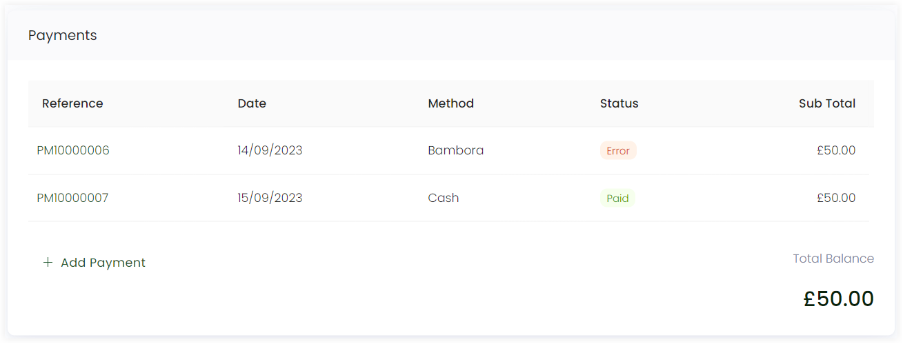
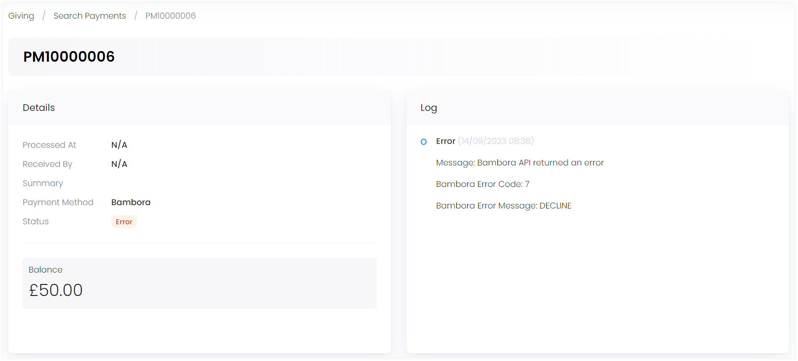

Failed payments refer to payment transactions that were attempted but did not successfully process. These can occur for various reasons and are crucial to monitor and manage for businesses or nonprofit organizations. Common reasons can be:

1. **Insufficient Funds:** The most common reason for a payment failure is insufficient funds in the payer's bank account or on their credit/debit card.

2. **Expired or Invalid Payment Method:** Credit cards or bank accounts can expire or become invalid. When customers attempt to pay with such methods, the transaction fails.

3. **Payment Declined by Bank:** The payer's bank may decline the transaction due to various reasons, including security concerns or unusual activity.

4. **Technical Issues:** Technical problems on the payment gateway or CRM system can lead to payment failures.

## Dealing with Failed Payments in Engage

Payments in Engage can be in the awaiting, declined, failed, cancelled, complete, draft or pending status. Any single donation or regular giving payment which was unable to process for completion comes with a **payment failed** status. 

:::note
To land onto a specific payment page, you can either directly <K2Link route="docs/engage/donations/payments/searching-payments/" text="search for a payment" isInternal /> itself or <K2Link route="docs/engage/accounts/searching-accounts/" text="search for an account" isInternal /> and look at the payment created for each donation by the account individually.  
:::

In this article, let's observe the record of all donations and their payments made by a specific account in the **Giving** section of their profile. 

:::tip
You can easily filter out failed payments for donations using the **Status** filter. Click the **filter** icon and select **Payment Failed** check box. All donations related to payment failed status will appear in the list.

::: 

1. On the **Giving** screen, filter out the payments for donations with a **Payment Failed** status. Click on the **donation reference number** to navigate to the **donation details** page to view the donation.

2. Scroll down to the **Payments** section and the **error** or **decline** status payment made related to that particular donation can be seen. Click the **payment reference number** to view the payment details. 

:::note
- A donation whose payment is in the **payment failed** status, comes with an error message on the top as "Payment(s) to this donation failed. Please see payment logs for further details."  
- Failed payment donation has the total payment amount as the **outstanding balance**.  
:::

3. You will see a page showing the particular payments **details** and **logs**. Logs include all the error detail messages due to which the payment failed or declined. 

4. After viewing the payment details and logs, you can go back to the **donations** page and make a payment for the outstanding balance again with the **'+ Add Payment'** option via other payment methods to remove the failed payment.