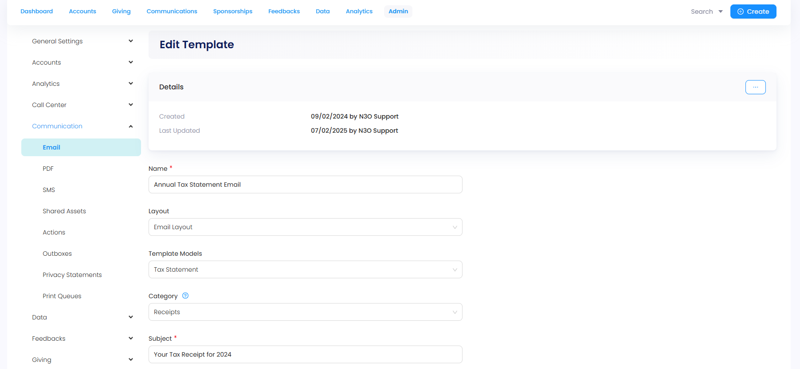
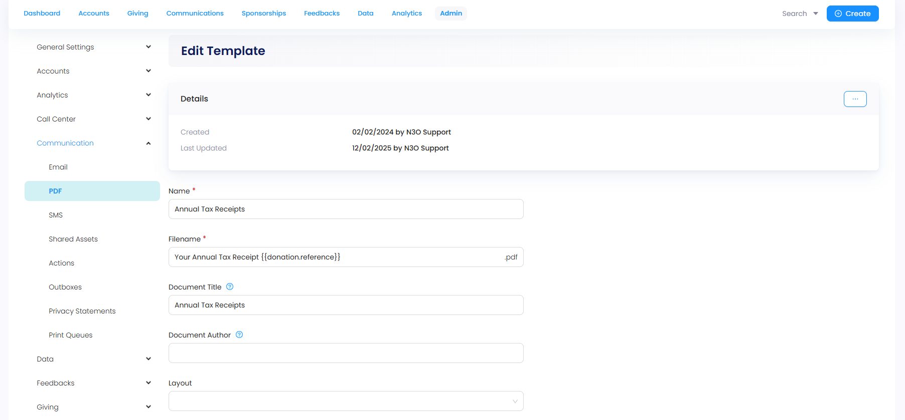
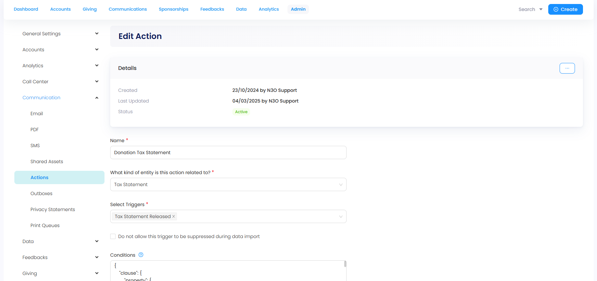
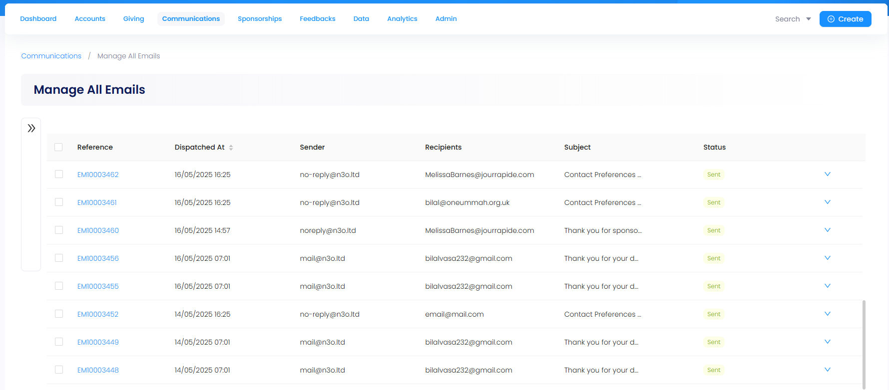

Tax receipts are official documents issued by a nonprofit or charity to acknowledge a donor’s contribution. They confirm that a donation was made and are often used by the donor to claim tax deductions or relief, depending on the laws of their country.

## Why are Tax Receipts Integrated into Engage?

Engage CRM manages, integrates and automates administrative tasks like issuing tax receipts for many reasons with some defined below:

- **Automation & Bulk Sending:** Engage can auto-generate and send tax receipts to hundreds or thousands of donors at once, reducing manual work.

- **Accuracy:** Since donation data is recorded directly in Engage, receipts are based on real-time and accurate information, reducing errors and omissions.

- **Legal Compliance:** Engage helps ensure every donation is properly acknowledged with the correct tax documentation required by law.

- **Donor Confidence & Transparency:** Issuing timely, professional receipts builds trust with donors and reassures them that their contributions are being handled responsibly.

## Formats to Generate a Tax Receipt

Engage provides two forms to generate a tax receipt: **Email** and **PDF**. Let's take a look at both.

### Email Tax Receipts

:::tip
- Email templates are created in the **Admin** section of Engage. Contact `support@n3o.ltd` and ask them to create an email template for you.
- To get a detailed understanding of email templates, visit the <K2Link route="docs/administrators/communication/setting-up-emails/email-templates/" text="Admin Email Template documentation" isInternal/>. 
:::

In order to generate an email tax receipt, the first step is to create an **email template**. 

**1.** Navigate to the **Admin** section, select **Email** under **Communication** and then **Email Templates**. 

**2.** Scroll down and click **Create New Template**. 

- **Name** the email as "Tax Statement Email" or as you require.
- Choose the **Layout**, **Template Models** as "Tax Statement" and **Communication** as "Receipts".
- Input **Subject** of the email, **sender name** and **sender's email address**.  
- Input **body** of the email and click **Save**. Select the **Preview** option, if you want to preview the email before sending. 

### PDF Tax Receipts

:::tip
- PDF templates are created in the **Admin** section of Engage. Contact `support@n3o.ltd` and ask them to create a PDF template for you.
- To get a detailed understanding of PDF templates, visit the <K2Link route="docs/administrators/communication/setting-up-pdfs/pdf-templates" text="Admin PDF Template documentation" isInternal/>. 
:::

In order to generate a PDF tax receipt, the first step is to create a **PDF template**. 

**1.** Navigate to the **Admin** section, select **PDF** under **Communication** and then **PDF Templates**. 

**2.** Scroll down and click **Create New Template**. 

- **Name** the PDF and provide its **filename** (you can input it the same as the name of the PDF).
- Input the **document title** (this can be the same as the name of the PDF) and **document author**. 
- Choose the **Layout**, **Template Models** as "Tax or Donation Statement", **Communication** as "Receipts" and **Print Queue** as "Default".
- Choose **Stationery** (usually added by N3O as "Tax Receipt") and input the **collation order** along with the **body of the PDF**.  Click **Save** and select the **Preview** option, to download and view the PDF created.

The **actual PDF** includes two pages. The first page displays:

- Charity organization's **address** and **email**.
- Donor's **name**, **address**, and **postal address**.
- Fields including unique **receipt number**, **tax year**, **total amount** donated, tax receipt **issue location** + **date** and digital **signature** of issuing organization.

The second page displays a list of all the donations through a certain time period (most probably a year) carried out by the donor. The list includes:

- **Date** and **type** of donation.
- **Fund dimensions** (location and stipulation) for the donated item.
- **Project** under which the donation was made.
- **Gift aid** eligibility and **amount** donated. 
- **Total** calculations for types of **stipulation** (Zakat ul Fitr, Zakah, Sadaqah, etc.) and **grand total amount**.

## Sending Tax Receipts to Donors

As soon as an email and PDF template is created for a tax receipt, the next step is to send it the donors. 

**1.** Confirm the type or category of donors to whom the tax receipt would be sent to. For instance:

- Only individual donors having complete donor details and no missing information like first & last name, postal address or code, and email. 
- No client organizations or charity event donors. 

**2.** Navigate to the **Admin** section, select **Actions** under **Communication** and create an action/trigger to automatically send the tax receipts. 

- **Name** the trigger and select the **kind of entity** the action is related to.
- Choose the **trigger** and add the conditions confirmed previously in the **Conditions** box.
- Add the created **PDF template** under **Post**, **Email template** under **Email** and click **Save**.

**3.** This action starts sending out the tax receipts to the donors respectively. All email receipts sent can be viewed on the **Manage All Emails** dashboard under **Communications**. **"An important step to remember: tax receipts are sent to donors whose conditions match the ones confirmed and have "email communication" contact preferences as "opted in" within the CRM, otherwise they are suppressed and not sent."**

