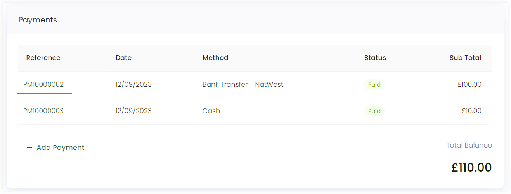
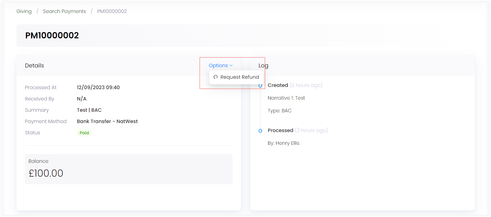
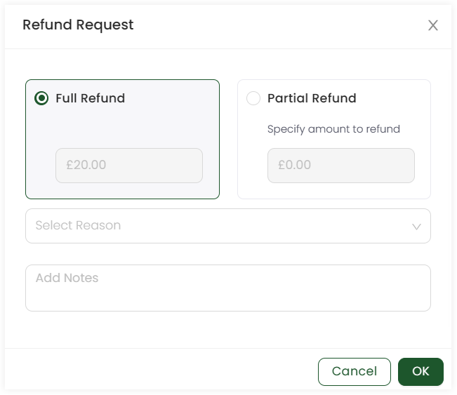
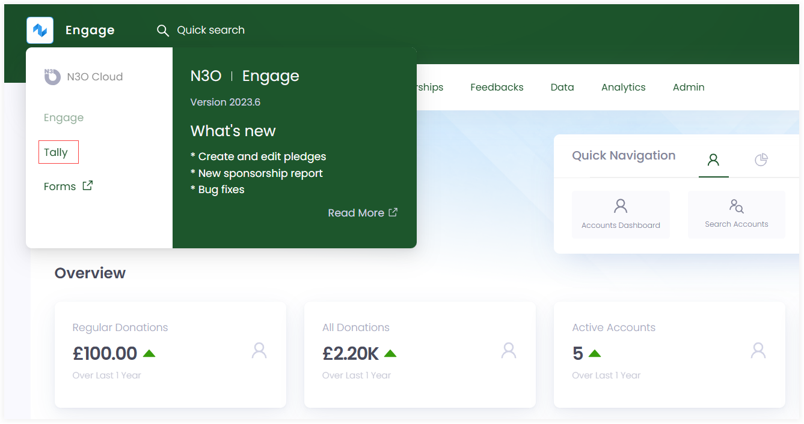
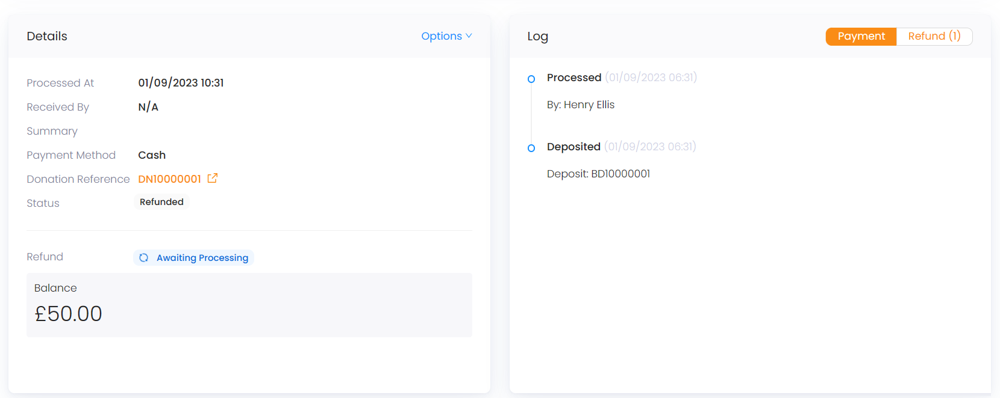

Refunds within a CRM refer to the process of reimbursing a donor for a previous payment. It is essential in terms of:

1. **Error Correction:** Refunds allow organizations to rectify billing errors or mistakes promptly. This is important for maintaining trust and credibility.

2. **Customer Retention:** Managing refunds effectively can lead to improved customer retention. Customers who experience a smooth and fair refund process are more likely to continue doing business with an organization.

3. **Dispute Resolution:** Refunds can help resolve disputes and conflicts between organizations/individuals and customers or donors. They provide a mechanism for addressing issues and finding amicable solutions.

## Requesting a Refund in Engage

In Engage, an account can make a refund request for a payment made via any payment method.

:::note
Refund request is made within **Engage** and approved in **Tally** by the system administrator. 
:::

1. Go to the **Giving** section in an accounts profile menu and scroll down to **Records**. Select any donation and click its reference number.

:::tip
You can also search for any existing payment via the advanced search option.
:::

2. In the **Payments** section, select any payment and click its **reference number**. The payment screen will appear.

3. In the **Details** section, click **Options** and select **Request Refund**.

4. Choose whether you want a **full refund** or a **partial refund**. Select the **reason**, add any notes, and click **OK**. The **Refund status** under the "Details" section would show **Awaiting Approval**.

:::tip
- **Full refund:** The whole amount would be refunded back to the donor.
- **Partial Refund:** The amount specified only would be refunded back to the donor.
- You can also view the refund requested under the **Refund** tab in the **Log** section. 
:::

## Approving a Refund in Tally

1. Click on Engage in the top left corner and select **Tally**. 

2. Click **Payments** in the navigation menu or **Search Payments** under quick navigation. Search for the payment whose refund was requested. A simple way is to search via the payment reference.

3. Open the payment details. You will see a **!Refunds**, **Details** and **Log** section. Ask your system administrator to approve the refund request for you i.e. after selecting a method and adding notes in the **Approve Refund Request** prompt screen.

4. As soon as the request is approved, an **Approved** text would show in the **!Refunds** section along with a **Refunded** status in the **Details** section. 

:::note
You can also view the logs of the refund processed by clicking **Refund** in the **Logs** section. 
:::

5. Click the **Donation reference** related to the payment refund under the **Details** section, and view donation details related to the refunded amount, balance and outstanding amount, etc. In case of **partial refund**, edit the allocation again in the donation details screen, equal to the balance amount i.e. the amount left after the refund.
