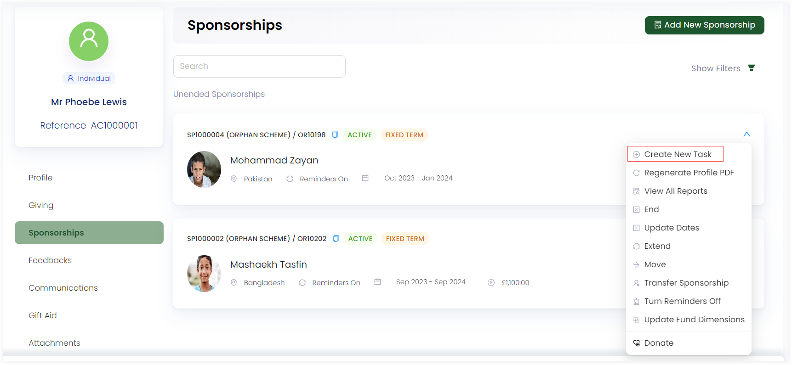
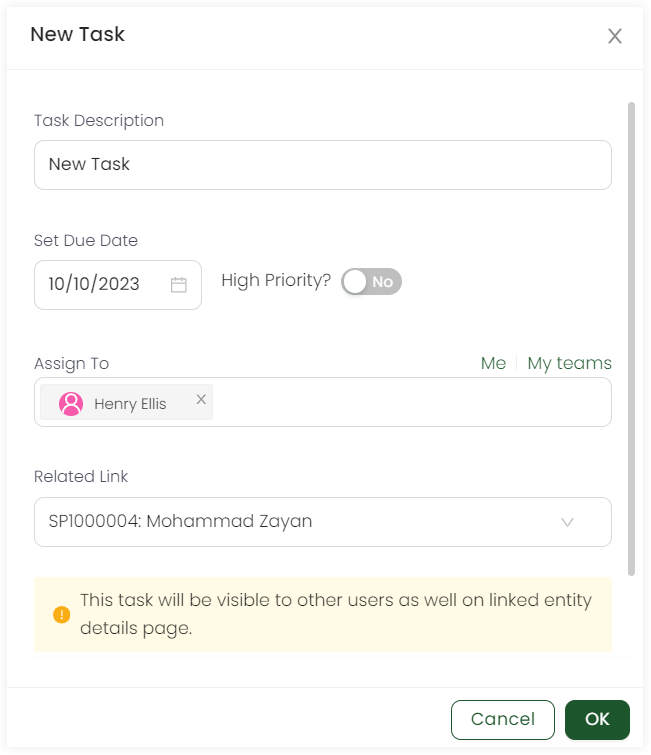

Similar to assigning tasks to an account, individual tasks can be created and allocated to various beneficiaries under a particular sponsorship. To get a familiarity with tasks, refer to the <K2Link route="docs/engage/accounts/tasks/" text="Tasks Documentation" isInternal/>.

1. On the <K2Link route="dashboard" text="Engage dashboard" isEngage />, click the **checklist icon** in the top right corner and click **Create New Task** or scroll down to the *Tasks list* and click **New Task**.  

:::tip
- You can <K2Link route="docs/engage/accounts/searching-accounts/" text="search for an account" isInternal/> that created the sponsorship, open up the *Sponsorships* page, click the down arrow on the selected sponsorship and click **Create New Task**.

- You can also search for sponsorships, click sponsorship reference to view any sponsorship, click the down arrow and then **Create New Task**.   
:::

2. On the **New Task** pop-up screen, specify the following input parameters and click **OK**.

| Parameters | Description |
| ---------- | ----------- |
| **Task Description** | A *one liner description* for the new task being made. |
| **Set Due Date** | The *date* by which the task should be completed. |  
| **Priority** | The importance of the task as *High* or *Low*. High priority tasks when created have a red circular dot at the start of the task description. | 
| **Assign to** | The assignment of the task. It can be the administrator, a specific account/sponsorship or accessible to everyone *(My teams)*. | 
| **Related Link** | This will be prepopulated to the sponsorship automatically for whom you are creating a task. |
| **Add More Details** | A button to add more details related to the task, if any. Also, any task file made externally can also be added with the *Add File* option within. |

