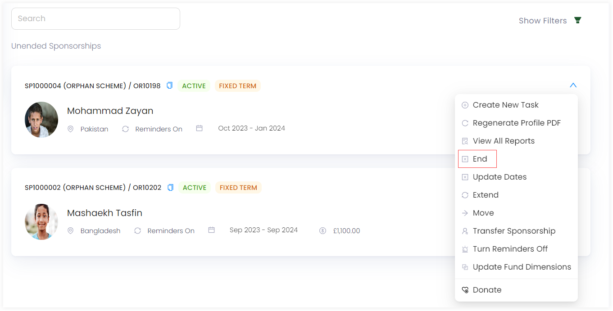
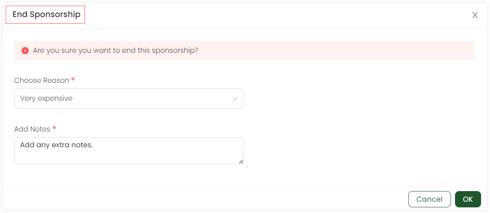

Cancelling a sponsorship means to disconnect a particular beneficiary from its related donor/sponsor. As a result, that beneficiary can be transferred to another donor or become available to be sponsored by another donor.

To cancel a sponsorship in Engage, follow the steps.

1. <K2Link route="" text="Search for a sponsorship" isInternal/> and view a list of all existing beneficiaries under sponsorships or <K2Link route="docs/engage/accounts/searching-accounts/" text="search for an account" isInternal/> that created a particular sponsorship and go to the Sponsorships page.

2. Choose the beneficiary sponsorship you wish to cancel, click the down arrow and then **End**.

3. An **End Sponsorship** screen pops-up which will end the current sponsorship of the beneficiary with the donor. Choose any reason to end from the drop-down, add any extra notes and click **OK**.

