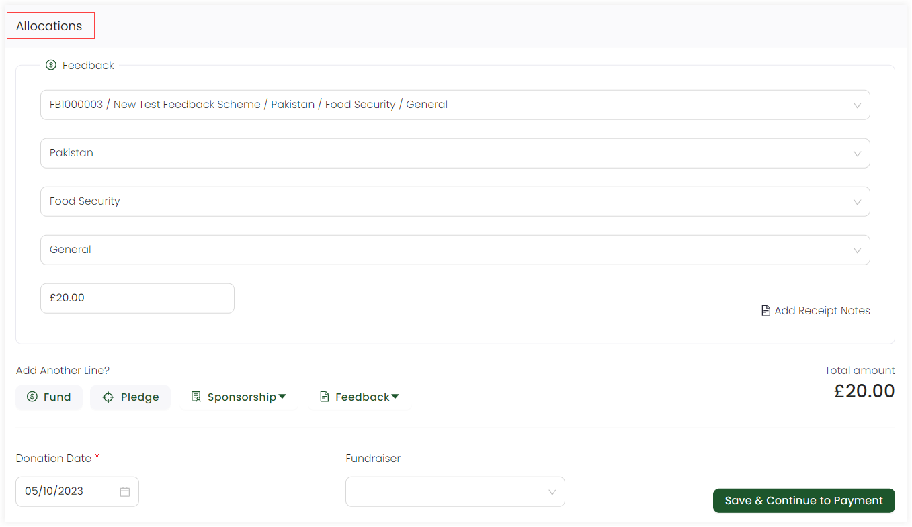

In Engage, whenever a feedback is created under a particular feedback scheme, the donor can donate towards that feedback at any time. This donation can be both single or a regular giving donation. To learn more about donations, refer to the <K2Link route="docs/engage/donations/" text="Donations Documentation" isInternal/>.

To make a donation towards a feedback, follow the steps defined.

1. While creating a feedback, in the last step, select **Create and Donate** to immediately donate or click *Enter Donation* on the <K2Link route="giving" text="Giving dashboard" isEngage />, choose an account and then donate towards a new or existing feedback.

:::note
Each created feedback when viewed has different fields and sections defined e.g. if no donation is made, the feedback would have an *Awaiting Payment* status and the *Ledger* section would include a list of all those donations.
:::

2. When immediately donating towards a feedback, the created feedback is prepopulated in the *Feedback* tab showing the reference, feedback scheme type and fund dimensions under the *Allocations* section.

3. Similarly, you can also select any other existing feedback or create a new one to donate to via the *Feedback* option at the end of the Allocations section.

4. The total amount would be the amount donated and shown at the end of the *Allocations* section. Click *Save and Continue to Payment* and pay via the payment methods available in the *Payments* section.

:::note
To read more on how to make payments, go to <K2Link route="docs/engage/donations/payments/payment-types/" text="Payment Types and Methods Documentation" isInternal/>.
:::
 