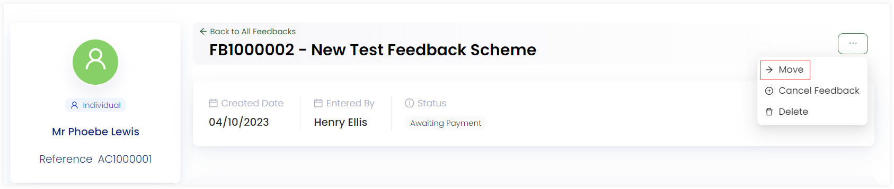
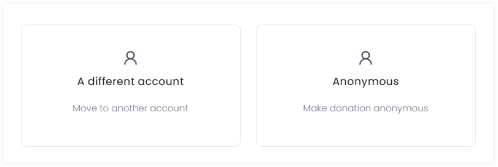
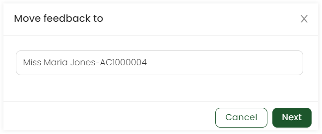
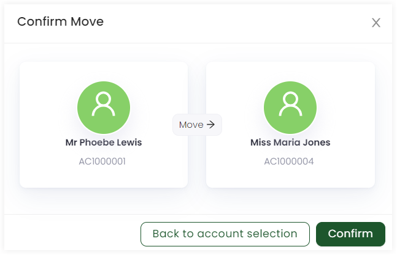

Engage allows moving a certain feedback under a scheme from one donor to another. This can happen due to any reason e.g. availability of the donor or other circumstances.

To move a feedback, follow the steps defined.

1. <K2Link route="" text="Search for a feedback" isInternal/> and view a list of all existing feedbacks or <K2Link route="docs/engage/accounts/searching-accounts/" text="search for the account" isInternal/> that created a particular feedback and go to the Feedbacks page.

2. Click the feedback reference to view the complete feedback. On the top left-hand side, click the **three dots (...)** and select **-> Move**.

3. Select to move the feedback to a different donor account or make it anonymous.

4. If you select to move the feedback to a different donor, a *Move Feedback to* screen pops up. Search for the account and click *Next*.

5. Click *Confirm* to confirm the move of the feedback to the selected donor account. 

