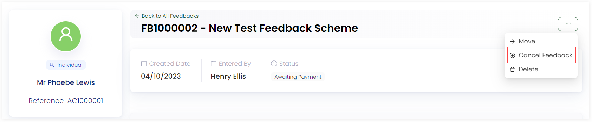
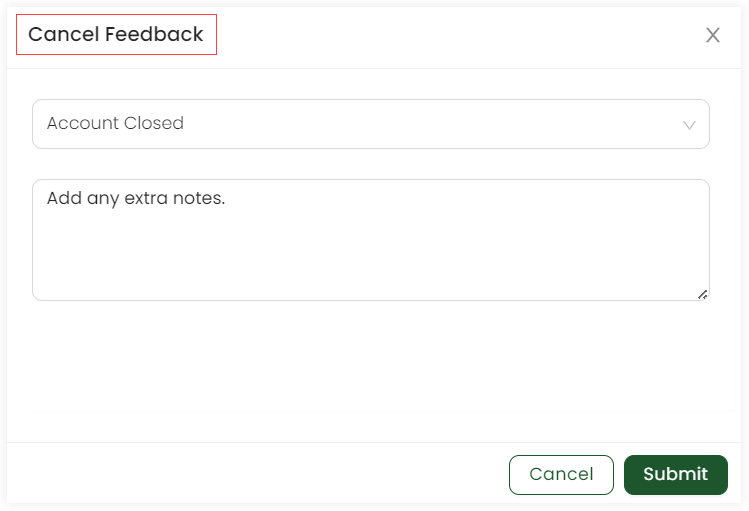

Engage allows you to cancel any existing feedback under a scheme. This can occur for many reasons e.g. an account that created a feedback got closed, the feedback scheme/project got delayed for too long or cannot be further processed.

To cancel a feedback, follow the steps defined.

1. <K2Link route="" text="Search for a feedback" isInternal/> and view a list of all existing feedbacks or <K2Link route="docs/engage/accounts/searching-accounts/" text="search for the account" isInternal/> that created a particular feedback and go to the Feedbacks page.

2. Click the feedback reference to view the complete feedback. On the top left-hand side, click the **three dots (...)** and select **Cancel Feedback**.

3. A **Cancel Feedback** screen pops-up which will end the current feedback under a scheme. Choose any cancellation reason from the drop-down, add any extra notes and click **OK**.

:::note
Cancellation reasons are added by the system administrator.
:::

