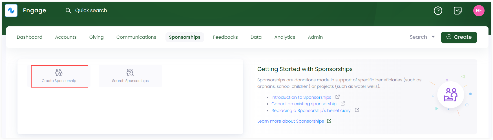
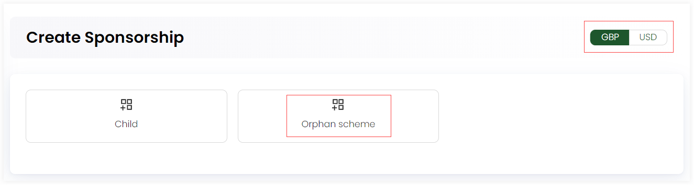
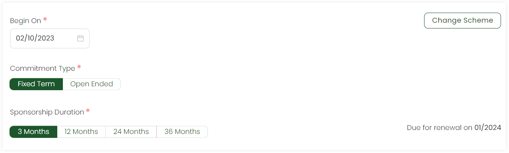
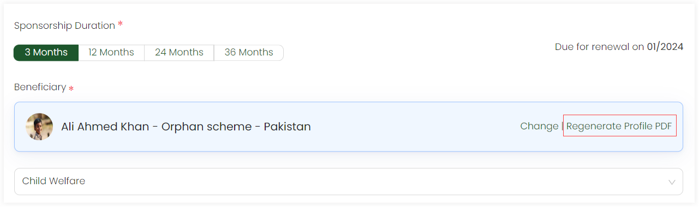
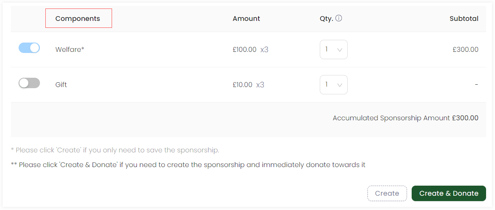

In Engage, an account (donor or sponsor), whether individual or organization, can create a sponsorship to sponsor a beneficiary in support of any cause. This page will walk you through the steps to create a new sponsorship.

:::note
- By default a sponsorship is created as anonymous. To associate the sponsorship with an account, click *Change Account* and choose the account accordingly.
- Before creating a sponsorship, ask your system administrator to add sponsorship schemes for you.
- To avoid any duplicate sponsorships and their problems, first <K2Link route="" text="search for a sponsorship within Engage" isInternal/>.
:::

## Option 1: Create a Sponsorship using Create

- On the <K2Link route="dashboard" text="Engage dashboard" isEngage />, click the **Create** button. A bar containing different icons will be shown.

- Click **Create Sponsorship**. This will take you to the create sponsorship screen.

## Option 2: Create a Sponsorship using Quick Navigation

- On the <K2Link route="sponsorships" text="Sponsorship dashboard" isEngage />, navigate to **quick navigation**.

- Click on **Create Sponsorship** and a screen will appear to create the sponsorship.

## Create a New Sponsorship

1. On the **Create Sponsorship** screen, choose any scheme e.g. "Orphan Scheme" and currency e.g. "GBP" on the left-hand side.

:::note
After selecting a scheme, you can also change it to another one with the *Change Scheme* option. 
:::

2. Choose the *Begin On* date. By default, the date is displayed as the current date.

3. Select the *Commitment Type* as fixed term or open-ended and *Sponsorship Duration* e.g. 3 months.

4. Select the beneficiary to sponsor. By default, a beneficiary will be prepopulated, but you can change it via clicking the *Change* option that displays a *Search Beneficiary* screen with a list of all beneficiaries and their name, age, location and gender. Select the one you wish to choose.

:::info
You can also generate the "profile PDF" for the beneficiary for the first time via *Regenerate Profile PDF*. As soon as the PDF is generated, an option *Download Profile PDF* is displayed to download it if necessary. You can also view all reports related to the beneficiary e.g. annual reports via *View All Reports*.  

:::

5. Choose the fund dimensions as defined by your system administrator for the beneficiary. Next, in the *Components* table, you can view the different components added in the scheme and their subtotal (price multiplied by the sponsorship duration) along with the accumulated sponsorship amount at the end. 

:::note
Mandatory components are necessary to sponsor and optional can be choosen via the toggle button.
:::

6. Lastly, click **Create** if you only need to save the sponsorship or **Create & Donate** if you need to create the sponsorship and immediately donate towards it. The donation can be made as single or regular donation.