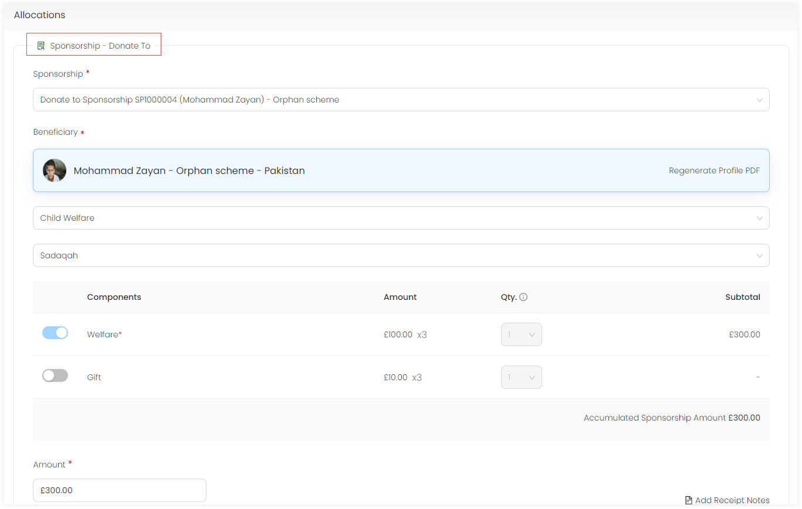

In Engage, once a sponsorship has been created for a particular beneficiary under any related scheme, the donor/sponsor can donate towards that sponsorship at any time. This donation can be both single or a regular giving donation. When a certain donation is made, a donor can always make an additional donation. 

:::note
To read more on how to make single or regular donations, go to <K2Link route="docs/engage/donations/creating-donations/" text="Creating Donations Documentation" isInternal/>.
:::

To make a donation towards a sponsorship, follow the steps defined.

1. While creating a sponsorship, in the last step, select **Create and Donate** or search for a sponsorship, click the down arrow on the pop-up screen and select **Donate**. An *Enter Donation* page will appear.

:::tip
You can also <K2Link route="docs/engage/accounts/searching-accounts/" text="search for an account" isInternal/>, go to *Sponsorships*, view all the beneficiaries that the accout has sponsored and select anyone to donate to. 
:::

2. In the *Allocations* section, the sponsored beneficiary will be prepopulated in the *Sponsorship - Donate To* tab showing the reference and type of sponsorship along with the beneficiary name and location.

3. The total amount would be the amount donated and shown at the end of the *Allocations* section. Click *Save and Continue to Payment* and pay via the payment methods available in the *Payments* section.

:::note
To read more on how to make payments, go to <K2Link route="docs/engage/donations/payments/payment-types-and-methods/" text="Payment Types and Methods Documentation" isInternal/>.
:::