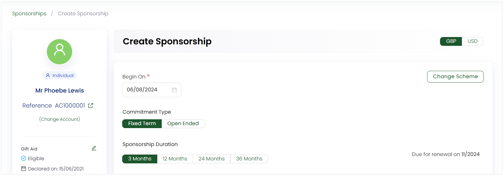

In Engage, an account, whether individual or organization, can create a sponsorship to sponsor a beneficiary in support of any cause. The first step to creating a sponsorship is landing on the **Create Sponsorship** screen. Either use method 1 or 2 and start creating.

:::note
- By default a sponsorship is created as anonymous. To associate the sponsorship with an account, click **Change Account** and choose the account accordingly.
- You can also visit an accounts profile menu, click **Sponsorships** and then **Add New Sponsorship** to create a sponsorship for that particular account. 
:::

## Method 1: Create a Sponsorship using Create

- On the <K2Link route="dashboard" text="Engage dashboard" isEngage />, click the **Create** button. A bar containing different icons will be shown.

- Click **Create Sponsorship**. This will take you to the **Create Sponsorship** screen.

## Method 2: Create a Sponsorship using Quick Navigation

- On the <K2Link route="sponsorships" text="Sponsorship dashboard" isEngage />, navigate to **quick navigation**.

- Click on **Create Sponsorship** and navigate to the **Create Sponsorship** screen.

## Steps to Create a New Sponsorship

:::tip
- Before creating a sponsorship, ask your system administrator to add sponsorship schemes for you.
- To avoid any duplicate sponsorships and their problems, first <K2Link route="docs/engage/sponsorships/searching-sponsorships/" text="search for a sponsorship within Engage" isInternal/>.
:::

**1.** On the **Create Sponsorship** screen, choose any **scheme** and **currency** on the left-hand side. By default, the currency is set to **GBP**.

:::tip
After selecting a scheme, you can also change it to another one with the **Change Scheme** option. 
:::

**2.** Choose the **Begin On** date. By default, the date is displayed as the current date.

**3.** Select the **Commitment Type** as fixed term or open-ended and **Sponsorship Duration**.

**4.** Select the **beneficiary** to sponsor. By default, a beneficiary will be prepopulated, but you can change it via clicking the **Change** option that displays a **Search Beneficiary** screen with a list of all beneficiaries and their name, age, location and gender. 

:::info
You can also generate a **profile PDF** for the beneficiary for the first time via **Regenerate Profile PDF**. As soon as the PDF is generated, an option **Download Profile PDF** will be displayed to download it if necessary.  

:::

**5.** Choose the **fund dimensions** as defined by your system administrator for the beneficiary. In the **Components** table, view the different components added in the scheme and their subtotal (price multiplied by the sponsorship duration) along with the accumulated sponsorship amount at the end. 

:::note
Mandatory components are necessary to sponsor and optional can be choosen via the toggle button.
:::

**6.** Lastly, click **Create** if you only need to save the sponsorship or **Create & Donate** if you need to create the sponsorship and immediately donate towards it. The donation can be made as single donation or regular giving.

