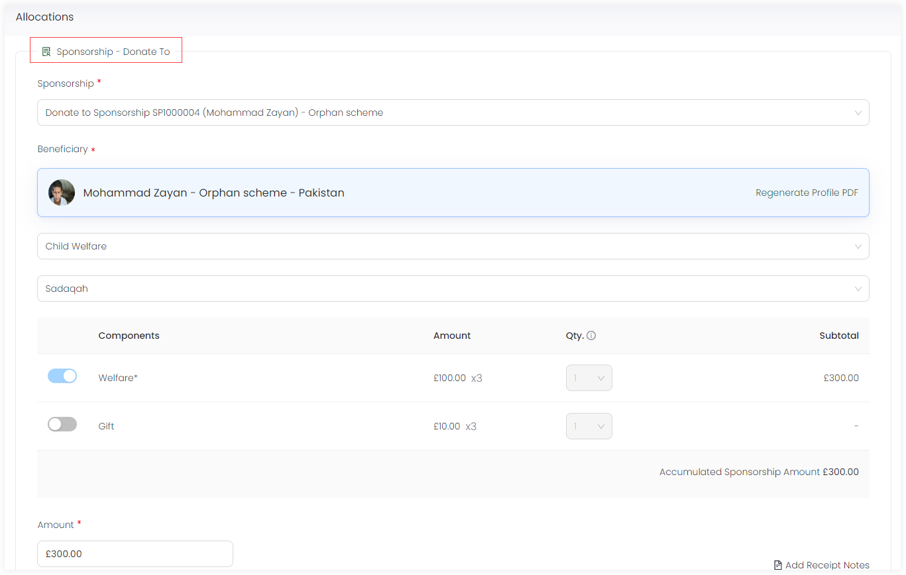

In Engage, once a sponsorship has been created for a particular beneficiary under any related scheme, the donor/sponsor can donate towards that sponsorship at any time. This donation can be both single or a regular giving. When a certain donation is made, a donor can always make an additional donation. 

:::note
To read more on how to make a general single donation or regular giving, go to <K2Link route="docs/engage/donations/creating-donations/" text="Creating Donations Documentation" isInternal/>.
:::

To make a donation towards a sponsorship, follow the steps defined.

**1.** To donate immediately while creating a new sponsorship, select **Create and Donate** and navigate to the **Enter Donation** screen. To donate later after saving a sponsorship, <K2Link route="docs/engage/sponsorships/searching-sponsorships/" text="search for the existing sponsorship" isInternal/> and click the **document icon**. On the sponsorship pop-up screen, click the **down arrow** and select **Donate** to land onto the **Enter Donation** screen.

:::tip
You can also <K2Link route="docs/engage/accounts/searching-accounts/" text="search for an account" isInternal/>, go to **Sponsorships**, view all the beneficiaries that the accout has sponsored and select anyone to donate to. 
:::

2. In the **Allocations** section, the sponsored beneficiary will be prepopulated under the **Sponsorship - Donate To** tab showing the reference and type of sponsorship along with the beneficiary name and location.

3. The total amount would be the amount donated and shown at the end of the **Allocations** section. Click **Save and Continue to Payment** and pay via the payment methods available in the **Payments** section.

:::note
To read more on how to make payments, go to <K2Link route="docs/engage/donations/payments/payment-types-and-methods/" text="Payment Types and Methods Documentation" isInternal/>.
:::