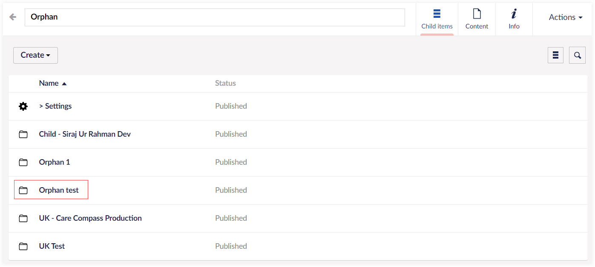
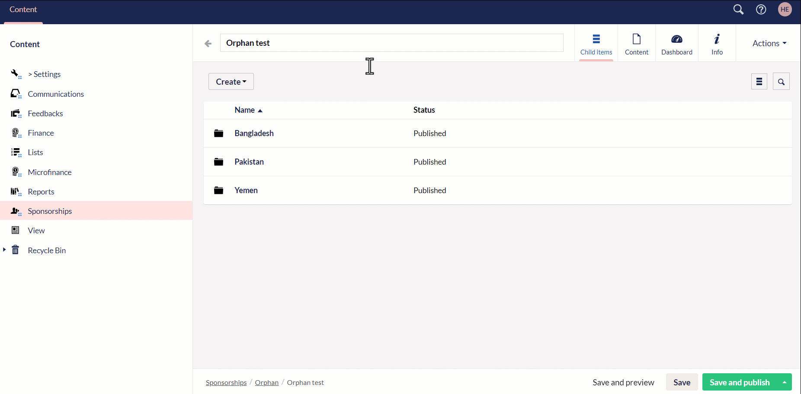

Engage allows you to add a beneficiary to sponsor via **Engage Forms** i.e. specifically designed for users to create and manage forms on the website. This means that whenever a beneficiary is added, it is automatically synced within Engage and visible for any donor to create sponsorships.

:::note
For any changes saved and published in Engage Forms, Engage automatically syncs and pulls the updated information.       
:::

To add a beneficiary, follow the detailed steps defined.

1. Login to *N3O Cloud Engage CRM* and open *Forms* by clicking on Engage in the top left corner. 

2. In the Content tab, click on **Sponsorships**. On the right-hand side, different sponsorship programs already existing and published in the system, containing name and status, will appear in the form of a list.

:::note
You can also add a new sponsorship program with the **Create** button under different categories.
:::

3. Choose any program, e.g. *Orphan*.

4. Select any scheme under the orphan program category, e.g. *Orphan test*. 

:::note
You can also add a new scheme with the **Create** button.
:::

5. Now, under each scheme, select any country and an existing beneficiary list (in this case 'orphans list') will appear including *name, status* and *reference* of each orphan. Click **Create** and *New Beneficiary* page will appear.

6. On the *Profile* tab, in the *Basic Info* section, enter *field reference*, click **Drop an image** to upload a *photo* of the beneficiary and set the *priority*. Input the *first name, middle name, last name, date of birth* and select the *gender*.

:::info
- Make sure the size of the image is minimum "1000x1000" dimensions. If the dimensions are less than the required, a warning message will be shown.
- By default, priority and location will be prepopulated, and you can change it as per necessary.
- Fields such as *ID, Cohort ID, Photo URL* etc are populated by the Umbraco system. 
:::

7. In the *Guardian* section, input all the details for the beneficiaries guardian including *first name, middle name, last name, date of birth*. Add the *Relationship* of the guardian with the beneficiary and any means of support.

8. In the *Health* section, add the *Health Standard* e.g. good, poor etc. 

9. In the *Residence* and *Attachment* section, add the *accomodation type* as rented or owned, *accomodation standards* as good, fair or poor and any *attachment* e.g. photo ID.

:::note
You can add more values for the pre-selected dropdown menu's in various input parameters e.g. guardian relationships, accomodations standards etc. After choosing any program, click *Settings* and you will see a list of different folders. Select any folder e.g. *Accomodation Standard* and create a new value for it.

:::

10. Click *Save* to only save the beneficiary information in Umbraco or *Save and publish* to automatically sync the Umbraco beneficiary information with Engage.

