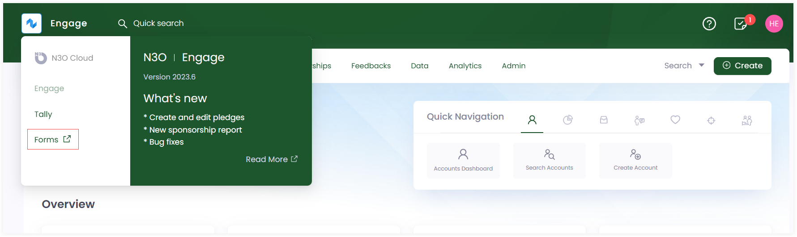
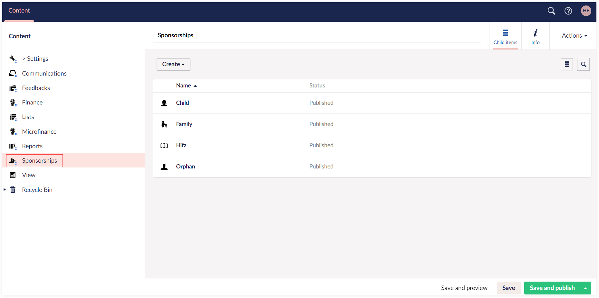
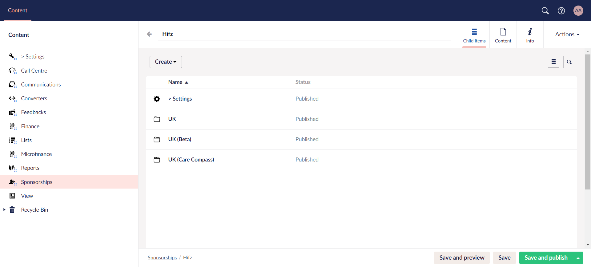
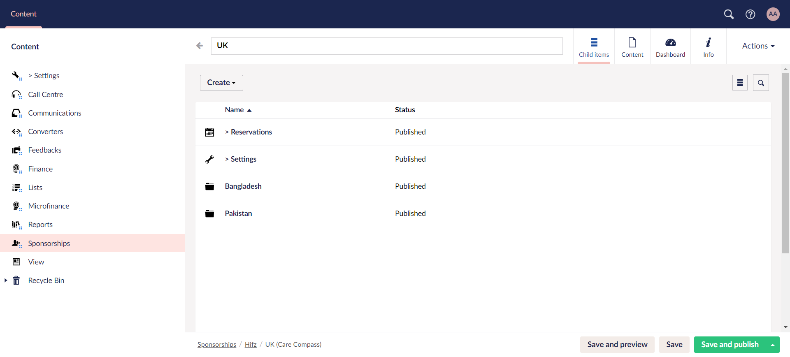
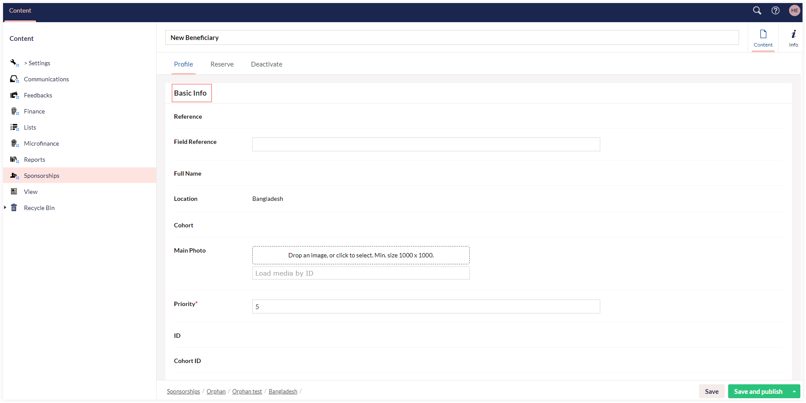
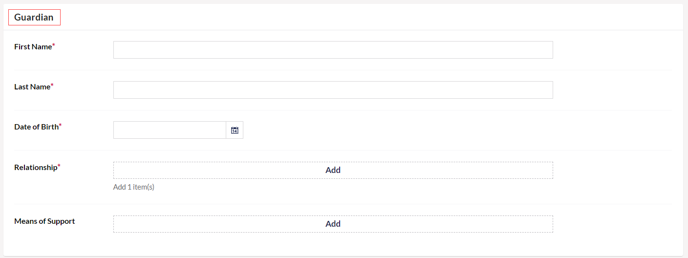
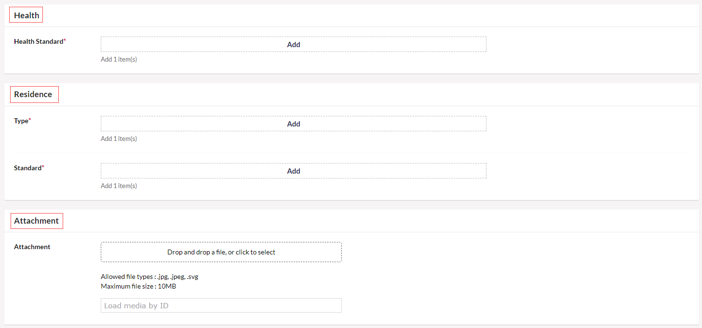
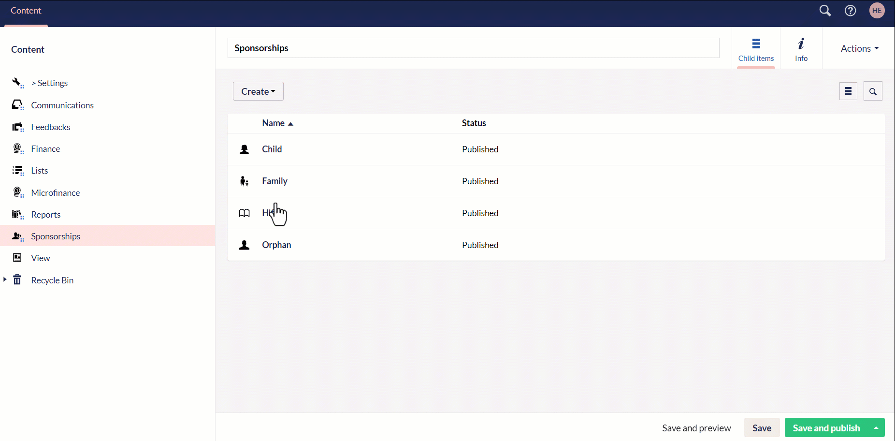
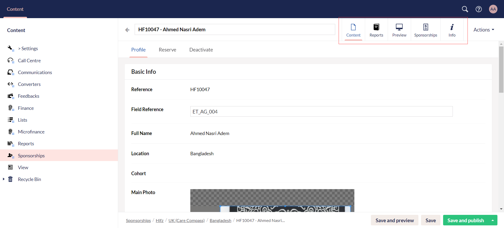

Engage allows you to add a beneficiary to sponsor via **Engage Forms** that is specifically designed for users to create and manage forms on the website. This means that whenever a beneficiary is added, it is automatically synced within Engage and visible for any donor to create sponsorships.

:::note
For any changes saved and published in Engage Forms, Engage automatically syncs and pulls the updated information.       
:::

To add a beneficiary, follow the detailed steps defined.

**1.** Login to **Engage** and open **Forms** by clicking on Engage in the top left corner. 

**2.** In the Content tab, click on **Sponsorships**. Different sponsorship programs already existing and published in Engage, containing name and status, will appear.

:::note
You can also add a new sponsorship program with the **Create** button under different categories.
:::

**3.** Choose any folder, and you can view further scheme folders created within. You can also create a new one via **Create**

**4.** Click on any scheme folder and create different locations via **Create** based on the **fund dimension "location"** for that scheme in Engage.

**5.** Choose any location folder, and you will see a list of all added beneficiaries for a particular scheme. 

**6.** To add a new beneficiary, click **Create** to populate the **New Beneficiary** screen. Under the **Profile** tab, in the **Basic Info** section, enter **field reference**, click **Drop an image** to upload a photo of the beneficiary and set the **Priority**. Input the **first name**, **last name**, **date of birth** and select the **gender**.

:::tip
1. Make sure the size of the image is minimum **"1000x1000"** dimensions. If the dimensions are less than the required, a warning message will be shown.
2. By default, **priority** and **location** will be prepopulated, and you can change it as per necessary.
3. Fields such as **ID**, **Cohort ID**, **Photo URL**, etc. are prepopulated by the Umbraco system.
:::

**7.** In the **Guardian** section, input all the details for the beneficiaries guardian including **first name**, **middle name**, **last name**, **date of birth**. Add the **Relationship** of the guardian with the beneficiary and any means of support.

**8.** In the **Health** section, add the **Health Standard** e.g. good, poor etc. 

**9.** In the **Residence** and **Attachment** section, add the **accomodation type** as rented or owned, **accomodation standards** as good, fair or poor and any **attachment** e.g. photo ID.

:::note
You can add more values for the pre-selected dropdown menu's in various input parameters e.g. guardian relationships, accomodations standards etc. After choosing any program, click *Settings* and you will see a list of different folders. Select any folder e.g. **Accomodation Standard** and create a new value for it.

:::

**10.** For each beneficiary, you can:

- Preview **HTML reports** under the **Preview** tab.
- View the donor account that is sponsoring the beneficiary under the **Sponsorships** tab with details including sponsorship **begin on** and **end date**. 
- Click **View in Engage** to view the sponsorship in Engage under the **Sponsorships** tab.

**11.** Click **Save** to only save the beneficiary information in Umbraco or **Save and publish** to publish and automatically sync the Umbraco beneficiary information with Engage.

