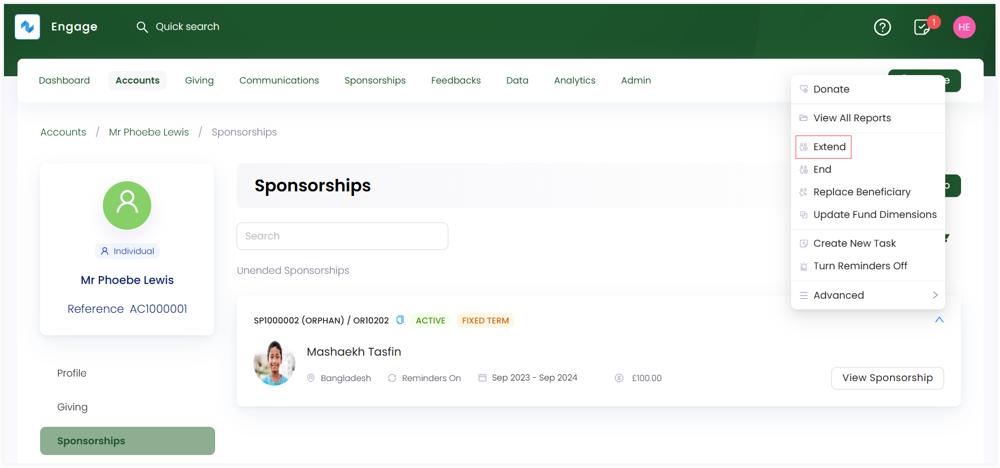
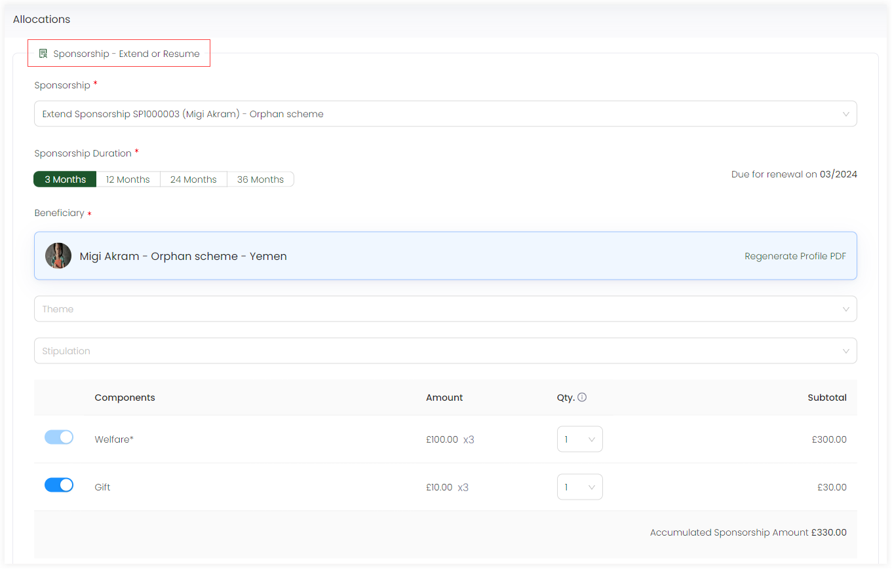

Extending a sponsorship involves the continuation of financial support from a donor/sponsor to a beneficiary beyond the initial agreed-upon sponsorship period. This extension can happen for various reasons, such as continue supporting a cause, positive outcomes from the sponsorship, or a wish to maintain a beneficial relationship.

1. <K2Link route="" text="Search for a sponsorship" isInternal/> and view a list of all existing sponsorships or <K2Link route="docs/engage/accounts/searching-accounts/" text="search for an account" isInternal/> that created a particular sponsorship and go to the Sponsorships page.

2. Choose a sponsorship you want to extend, click the down arrow and then **Extend**.

3. This opens up an *Enter Donation* screen with the *Allocations* section pre-populated with the selected beneficiary under the sponsorship with the title **Sponsorship - Extend or Resume**. Complete the *Allocations* section by selecting *Fundraiser* and click **Save & Continue to Payment**.

4. Select any payment type e.g. *card, cash* or *bank transfer* and then payment method to finish off with the payment details. Click **Enter Donation**. This will extend the beneficiary for the related donor.

