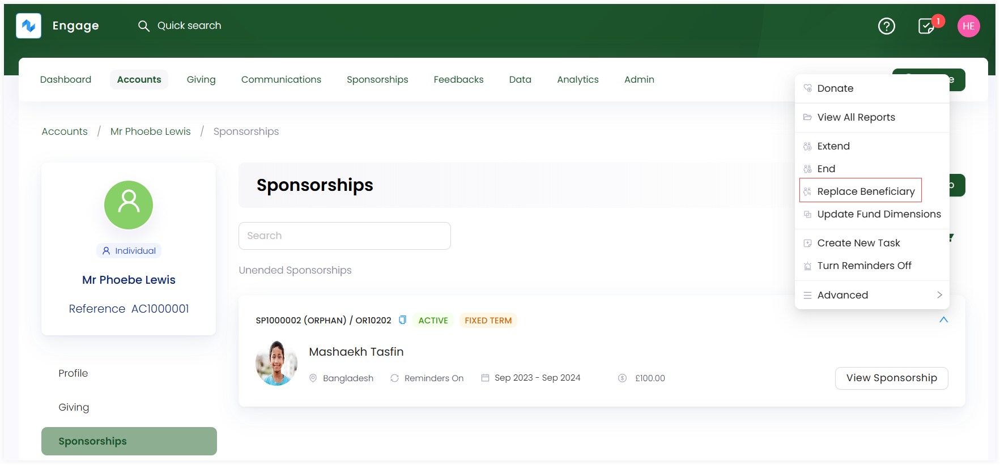

---
title: Transferring Sponsorships
sidebar_position: 9
--- 

Sometimes it can be necessary to replace and assign a new beneficiary to a donor. A few reasons could be that the beneficiary has reached a certain age and is no longer eligible according to the organizations policies, or the beneficiary may have left the program that the donor has requested.

To transfer a beneficiary to a new donor in Engage, follow the steps defined.

1. <K2Link route="" text="Search for a sponsorship" isInternal/> and view a list of all existing sponsorships or <K2Link route="docs/engage/accounts/searching-accounts/" text="search for an account" isInternal/> that created a particular sponsorship and go to the Sponsorships page.

2. Choose a beneficiary under a sponsorship you wish to transfer, click the down arrow and then **Transfer Sponsorship**.

3. A **Transfer Sponsorship to a New Beneficiary** screen pops-up which will end the current sponsorship of the existing beneficiary and assign a new one to the donor. You can select the prepopulated beneficiary or change it likewise and click **OK**.

