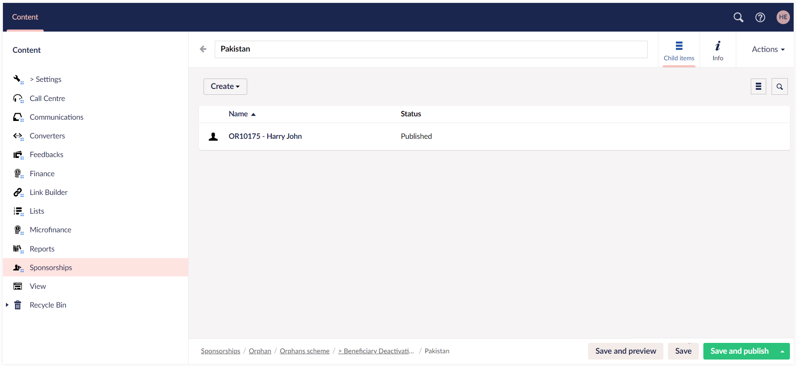

Sponsorship deactivation typically refers to the process of discontinuing or ending a sponsorship arrangement between an individual/organization and a beneficiary. This is primarily used when the organization wants to remove the beneficiary entirely from a pool of available beneficiaries.

Engage allows you to deactivate a sponsorship for any beneficiary through **Engage Forms**, specifically designed for users to create and manage forms on the website. When deactivated, a beneficiary will not be able to be published or sponsored. This is different from unpublishing a beneficiary which means they are temporarily unavailable, but can be published by the organization relatively easily for re-sponsoring.

:::note
- For any changes saved and published in Engage Forms, Engage automatically syncs and pulls the updated information.       
- For a deactivated beneficiary having an active sponsorship at the moment, Engage automatically assigns a new beneficiary to that specific sponsorship.
:::

## Deactivate a Beneficiary

1. Login to **Engage** and open **Forms** by clicking on Engage in the top left corner. 

2. In the Content tab, click on **Sponsorships**. Different sponsorship programs which already exist in the system and are published, will appear on the right-hand side.

:::note
You can also add a new sponsorship programs with the **Create** button under different categories.
:::

3. Choose any sponsorship program.

4. Select any scheme under the program category, e.g. **Orphans scheme**. 

:::note
You can also add a new scheme with the **Create** button.
:::

5. Now, under each scheme, select any country and a beneficiary list (list of orphans in this case) will appear which includes **name**, **status** and **reference** of each orphan.

6. Choose any orphan and view its complete profile under the **Profile** tab. 

7. Click the **Deactivate** tab, choose the **reason**, add any extra notes if required, click **Save and publish** and send a deactivate request for the selected orphan.

## Approve the Deactivated Beneficiary 

As a default, following the above process will not complete the deactivation process. Instead, beneficaries submitted for deactivation will be sent to a queue to be approved by the head office.  

To access this queue and approve the deactivation, please see the following steps:

1. Under the **Sponsorships** content tab, select any **program** and then **scheme**.

2. In the top right corner, click **Dashboard** and then the **Deactivations** tab.

3. You will see a list of all the beneficiaries submitted for deactivation. Click the **down arrow** under the **Action** tab and select **Approve** for any beneficiary.

4. A prompt to approve as **yes** or **no** will appear. Select **yes**, and the request will be approved.

5. The approved deactivated beneficiary will appear in the **deactivations folder** followed by the appropriate beneficiary **location folder**, under the previously chosen **scheme**.

