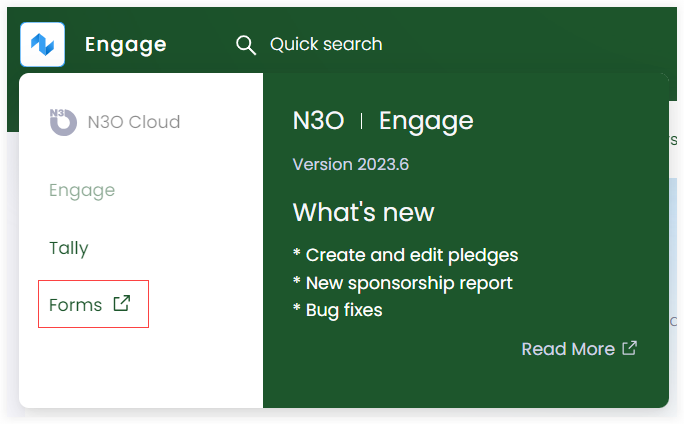
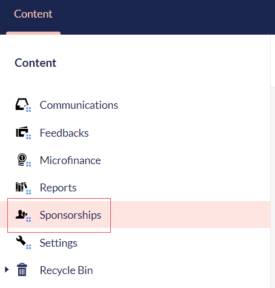
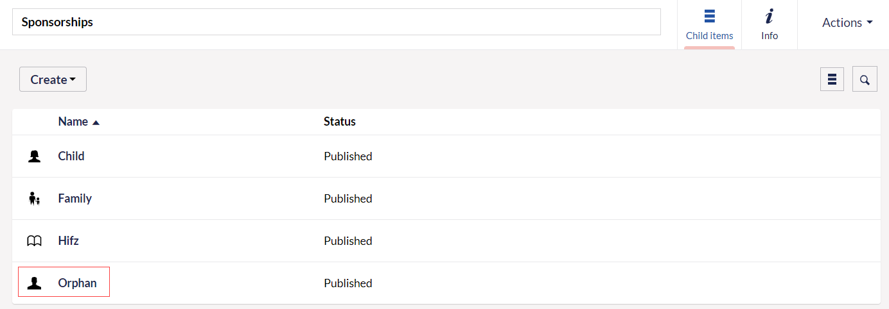

Sponsorship reservation applies to the practice of reserving or securing a sponsorship opportunity for a specific beneficiary. Engage allows you to reserve a sponsorship for any beneficiary through **Engage Forms**.

:::note
For any changes saved and published in Engage forms, Engage automatically syncs and pulls the updated information.       
:::

## Steps to Reserve Sponsorship

1. Login to *N3O Cloud Engage CRM* and open *Forms* by clicking on Engage in the top left corner. 

2. In the Content tab, click on **Sponsorships**. On the right-hand side, different sponsorship programs which already exist in the system and are published, containing name and status, will appear in the form of a list.

:::note
You can also add a new sponsorship program with the **Create** button under different categories.
:::

3. Choose any program, for e.g. *Orphan*.

4. Select any scheme under the orphan program category, for e.g. *UK- Care Compass Production*. 

:::note
You can also add a new scheme with the **Create** button.
:::

5. Now, under each scheme, select any country and a beneficiary list (list of orphans in this case) will appear which includes *name, status* and *reference* of each orphan.

6. Choose any orphan and view its complete profile under the **Profile** tab. 

7. In the **Reserve** tab, choose the existing beneficiary, set the expiry date, input a reason to reserve and add any extra notes. Click *Save and publish*.

:::note
- To reserve any sponsorship, you do not need any approval.
- Expiry date refers to the date till which you can sponsor a particular beneficiary. 
:::

