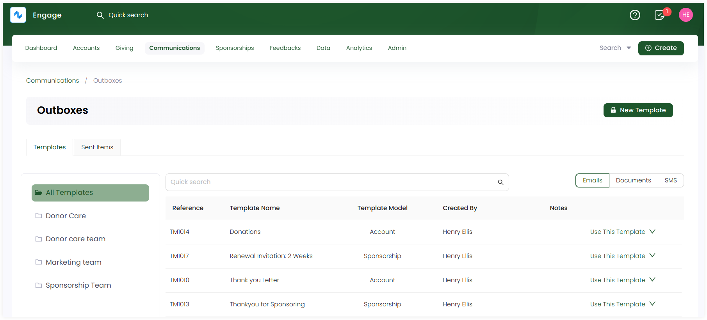
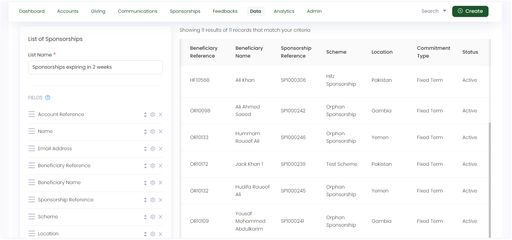
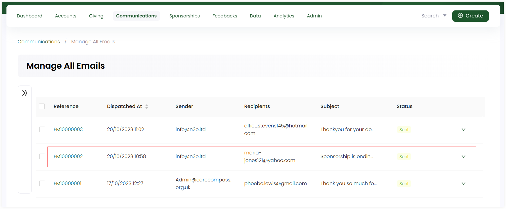
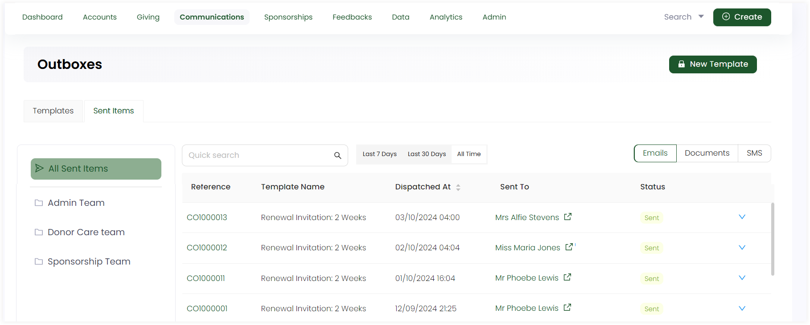

Generally, **auto emails** in a CRM refer to automated email messages that are triggered based on specific actions or events, without the need for manual intervention. These emails are part of the CRM’s automation capabilities and are designed to improve customer communication and streamline follow-ups.

**Engage's** auto emails functionality is divided into two parts:

1. Sending auto emails using the <K2Link route="docs/engage/communications/managing-emails/setting-automatic-triggers/" text="trigger and action mechanism" isInternal/>.
2. Sending auto emails in bulk using pre-defined templates created in an outbox and then connecting it with a list.

In this guide, let us look at how to send auto emails in bulk, using pre-defined templates created in outboxes and lists, for renewal of sponsorships ending after a certain time period.

## Create an Email Template in an Outbox

The first step required to send an auto email, is to create an **email template** in an outbox. 

**1.** Click on **Communications** in the header menu and then **Outboxes** to navigate to the **Outboxes dashboard**.

**2.** Choose the **Sponsorship Team** outbox and create an new email template via **+ New Template**. To learn about the template parameters, go to the <K2Link route="docs/engage/communications/outboxes/creating-templates-in-outbox/" text="Create Templates in an Outbox documentation" isInternal/>.

**3.** For now, we will use the existing pre-defined email template named, **"Renewal Invitation: 2 Weeks"**. 

## Connect the Email Template with a List  

The next step is to create a **sponsorship type** list and connect it with the outbox containing the sponsorship email template. 

**1.** Click on **Data** in the header menu and then **Lists** to navigate to the **Lists dashboard**.

**2.** Create a separate **sponsorships** folder under **My List** and then create a list with type **Sponsorship**.

**3.** Input the **list name** and populate the list **fields** and its **filters**. Be sure to include:
 
- **Email address** as a field as we are dealing with sending out emails.
- Filter defining time period for field **End On**, for example, 2 weeks or months. 

**4.** When the list is created, first, set it to **auto-refresh** so that the list can update any new sponsorships coming in. Then, click **Connect**, select the connection type as **Correspondence**, choose **Sponsorship** from the **"Send at most one correspondence per"** dropdown and tick the checkbox **Ignore Preferences**. Click **Next**, select the **email template** you created before under the specific outbox and click **Save Connection**. 

## Send Emails to Donors Automatically

As soon as the connection is set for the created list, Engage will start sending out auto emails to all the donors having sponsorships ready for renewal after a certain time period. To view all sent emails, you can either:

- Go to **Manage All Emails dashboard** under **Communications**.

- Or, click **Outboxes**, select **Sent Items** tab and see all emails sent under time period **All Time**.

