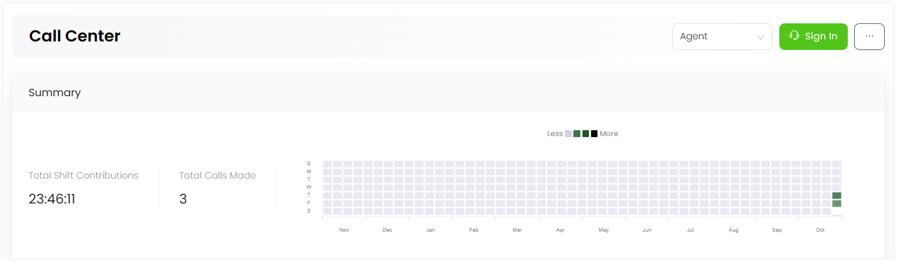
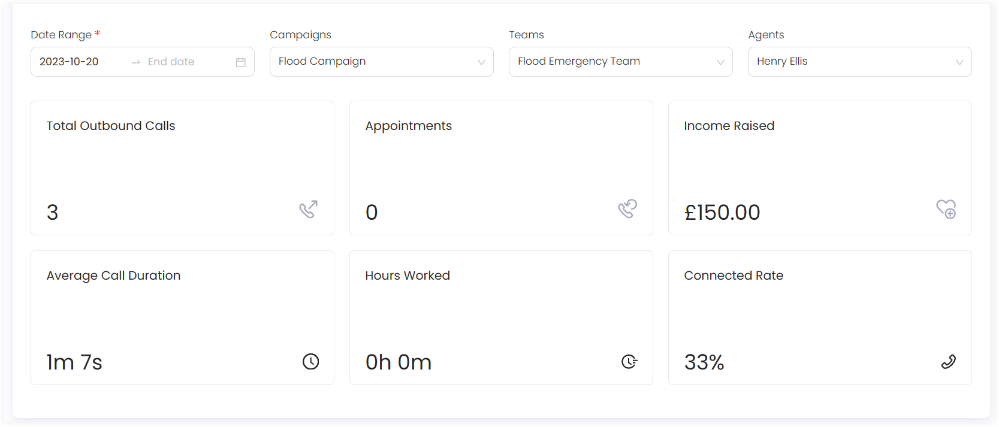
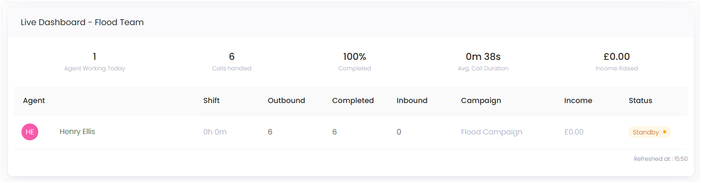

---
title: Call Center Dashboard
sidebar_position: 1
---  

Before moving to the call center dashboard, click on *Communications* in the top menu bar. You will see a communications dashboard containing *Communication Insights* where you can:

1. Pin various metrics to the communication's dashboard like *live dashboard of a certain campaign*.
2. View any *recent activity* done via communication channels by any account.

To land onto the call center dashboard, click *Call Center* in the quick navigation section of the *communications* screen.

The *Call Center* dashboard consists of a *Summary* section along with *Live dashboard's* of different campaigns. 

1. In the *Summary* section, you can view the total calls made or total shift contributions done during a certain time period. This information is also displayed via a graph depicting each week of a month.

2. You can also view different call parameters defined below for a certain campaign including a certain team with a selected agent and a specific date range of when the calls were made. Select an agent, campaign, team and view the stats for each.

| Call Parameters | Description |
| --------------- | ----------- |
| Total Outbound Calls | Total number of outbound calls made to reach donors. |
| Appointments | All appointments scheduled for donors. |
| Fund Raised | Total amount of funds/donations raised via the active campaigns over calls. |
| Average Call Duration | Average time in minutes and seconds for a certain call duration. |
| Hours Worked | Number of hours an agent in a team worked over a certain call. |
| Connected Rate | Connectivity rate of a number of calls made to reach donors over a certain campaign. |

3. In the *Live Dashboard - Campaign name* section, you can view a minimal dashboard dedicated to a currently active campaign consisting of 2 different parts. One part is a row that includes:

:::note
Live dashboards appear the moment a user working in a team and active campaign starts calling any donor.
:::

1. Number of agents working on a particular day
2. Number of calls handled on a particular day
3. Percentage of the data in calls completed
4. Average duration of a call
5. Income raised by a certain call

The other part is a table which indicates the following information about each agent from a team working on an active campaign.

:::note
1. **Outbound Calls:** Calls to reach out to clients for various purposes, such as conducting client surveys, following up on inquiries, or initiating donation campaigns.
2. **Inbound Calls:** Calls from clients seeking assistance, support, or information. These calls may include inquiries about products or services, technical issues, or general customer support.
:::

| Parameters (About Agent) | Description |
| ------------------------ | ----------- |
| Shift | Total time an agent worked on a campaign. |
| Outbound Calls Made | Number of outbound calls made. |
| Calls Completed | Number of calls completed. |
| Inbound Calls Answered | Number of inbound calls answered. |
| Active Campaign | Name of the active campaign. | 
| Status | Current condition of the agent. |
| Income Raised | Total income/donation raised from calls in a campaign. |

