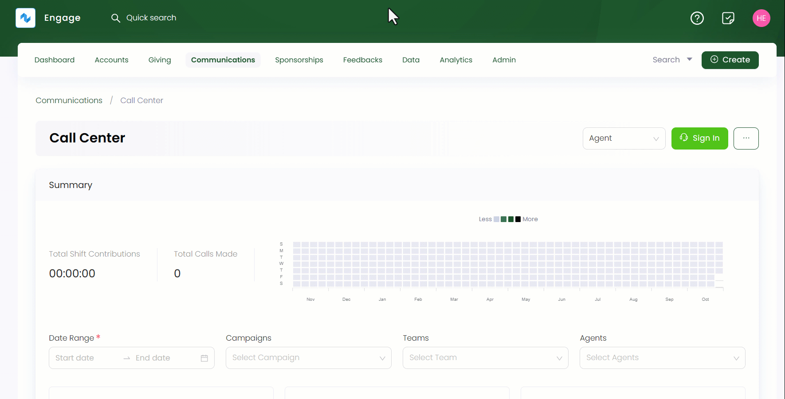
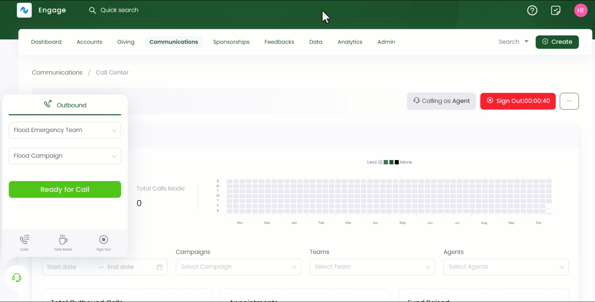

---
title: Calling a Donor
sidebar_position: 2
---  

Call center in Engage allows various dedicated job role users to call different donors at any time. These users can be agents, inbound or outbound callers working in a team under any campaign.

:::note
Job roles are added by your system administrator.
:::

To call any donor, follow the steps defined below.

1. Click *Communications* in the top menu bar and then *Call Center* in the quick navigation section to view the *Call Center* screen.

2. Select any job role e.g. *Agent* from the drop-down on the right-hand side and click the *Sign In* option to get ready for the call. This means that you are calling as an agent and signed in for your shift of the day.

:::info
A success popup appears with the message *Success signed into shift*.
:::

:::info
Before dailing a call, make sure that the accounts list is created and connected with any active campaign you are working on. To know more about list, go to the Lists Documentation.
:::

3. In the dailer popup screen, select the team and campaign and click *Ready for Call*. 

4. Now, Engage will assign you a donor to have a call with displaying the donor name, reference and phone number. Choose whether to start the call with this donor or skip the donor to another via selecting the skip reason and any notes. Starting the call will take you to the donors profile screen where you can make donations and perform other actions. As soon as the conversation finishes, you can end the call with an end reason e.g. *concluded*.

:::note
- Skip reasons are added by your system administrator.
- Sometimes when you make a call, the call center might give an indication of *Out of Data*. This means that all the donor data has been used, and no more contact is available for a certain campaign.

:::

5. You can also view all the calls and appointments made via the *Calls* button and take a break with the *Take Break* option. When the break is finished, resume your shift with *Resume Shift* dialer or button.

6. Lastly, when all calls are done, sign out from the job role using the *Sign Out* option.

:::tip
Each action done like taking a break or signing out comes with popup messages in the bottom right. 
:::