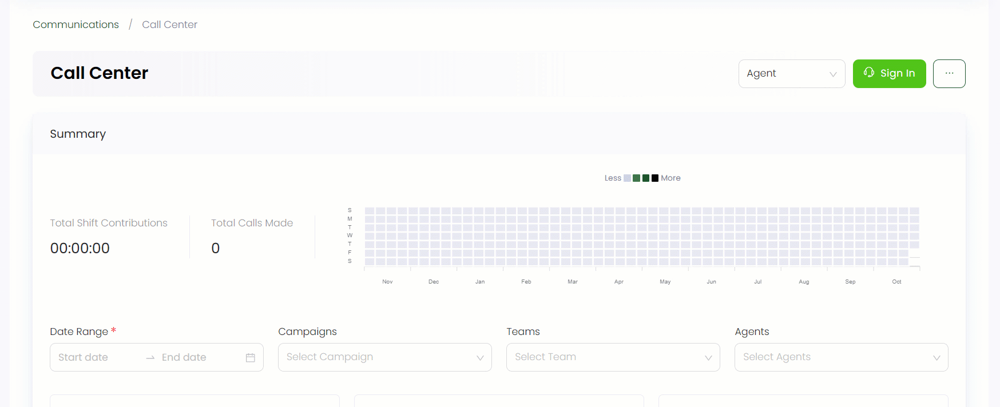

Teams allow an easy way for members to share, communicate and collaborate with different donors over a certain campaign. In Engage, you can manage teams to work on a certain campaign for donation. 

To view all the teams working under different campaigns, follow the steps.

1. Click on *Communications* in the top menu bar and then *Call Center* in the quick navigation section to view the *Call Center* screen.

2. On the *Call Center* screen, click the **three(...)** dots and select **Manage Teams and Campaigns**. The *Teams* tab shows a list of all teams working on assigned campaigns etc.

| Parameters | Description |
| ---------- | ----------- |
| Team Name | Name of the team for a respective campaign. |
| Description | Description of what the team will be working on. |
| Team Lead | The escort of the team. |
| Staff | Total members of the team. |
| Assigned Campaigns | Campaign for which the team will work on. |
| Status | Current condition of the team as active or inactive. | 

