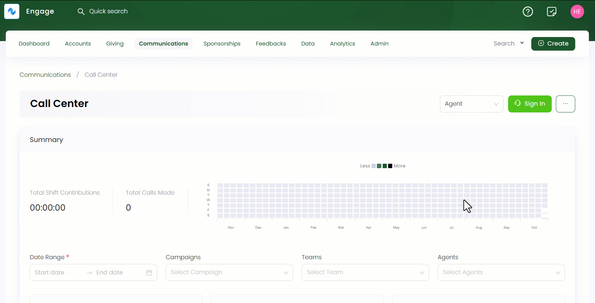
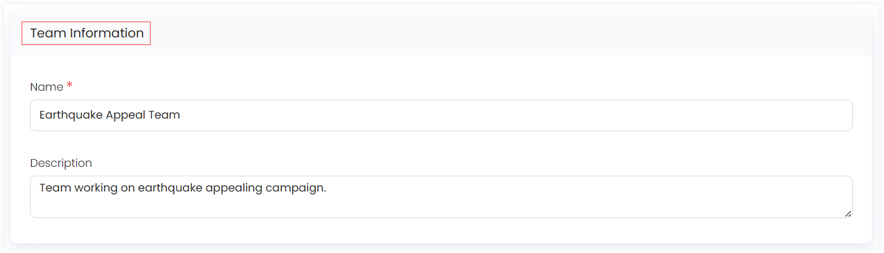

Engage allows you to create new and edit existing teams via the call center functionality. Follow the steps defined below to create a new team of callers under a certain campaign.

1. Click *Communications* in the top menu bar and then *Call Center* in the quick navigation section to view the *Call Center* screen.

2. On the *Call Center* screen, click the **three(...)** dots and select **Manage Teams and Campaigns**. Under the *Teams* tab, click the **Create New Team** option to land onto the *Create New Team* page.

3. In the *Team Information* section, input the **Name** of the team and its **Description**.

4. In the *Team Members* section, add the team members by clicking the **+ Add Team Members(s)** option. Add the user as a team member and click **OK**. Then click **Create**.

:::note Important
Users who have access to the call center can be added as a team member only.
:::

## Editing a Team

You can edit an existing team by clicking on the drop-down and then the **Edit icon** at the end of each team row or the *Team Name* under the *Teams* tab. This leads to the respective team page. Change any information, add or remove team members and click **Save**.

