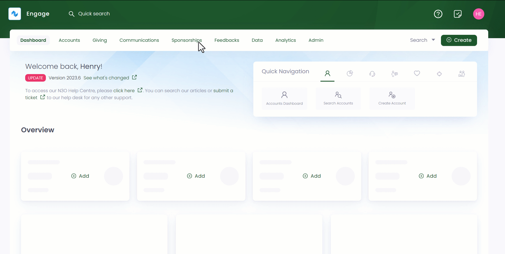
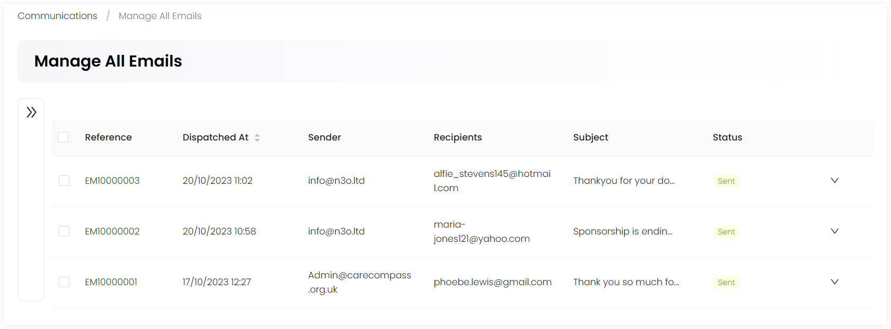

Emails play a crucial role as a communication channel for handling client inquiries, managing various interactions etc. Email communication complements voice-based interactions (phone calls) and offers several effective advantages defined.

- **Written Document:** Emails provide a written record of client interactions, allowing agents to refer back to previous communications for context and accuracy.

- **Global Reach:** Email communication transcends geographical boundaries, making it an effective channel for serving customers from different time zones or international locations.

- **Non-Intrusive Communication:** Some customers prefer not to engage in phone calls, especially for non-urgent inquiries or sensitive matters. Email offers a restrained communication option, allowing customers to reach out on their own time and provide detailed information.

## Managing Emails in Engage

In Engage, emails can be sent to respective accounts via the action and trigger mechanism for any specific purpose like updating contact preferences, sponsoring an orphan or payment plan expiry etc. 

1. Click *Communications* in the top menu bar and then *Manage All Emails* in the quick navigation section to land onto the *Manage All Emails* screen.

2. Here, you can view all emails with different parameters defined sent in response to different actions in the form of a list.

| Parameters | Description |
| ---------- | ----------- |
| Reference | The unique identification number of each email. |
| Dispatched At | The date and time of sending the email. |
| Sender | The name of the sender sending the email. | 
| Recipients | The person receiving the email. |
| Subject | The one liner subject of the email. | 
| Status | The status of whether the email has been sent or not. |

3. You can also view each email in detail via clicking on the *reference number*.

4. Emails with the status *sent* have been successfully send to the recipients but, emails showing a status of *not sent*, any *template error* can be retried by first clicking on the *down arrow* at the end of each row and then *retry*. 

## Searching an Email

You can also search for an email in the list using the **Filters** panel on the left. 

1. Expand the *Filters* on the left to search for the exact email. Click the '+' icon next to *Search Criteria* and specify any parameter defined in the table.

| Search Parameters | Description |
| ----------------- | ----------- |
| Status | Select the status of the email. | 
| Reference | Input reference number of an email. |
| Sender | Input sender's email address. |
| Email Subject | Input subject of the email sent. | 
| Recipient | Input recipient's email address. | 
| Dispatched At | Input the *From date* or *To date* at which the email was sent. |

2. Click the **Search** button and the results are loaded *"one page"* at a time on the right. Use a **Load More** button at the bottom of the result list to get further results.

:::tip
- You can specify the *From Date* or the *To Date* and do not need to specify both. 
- If you wish to remove the search input for all parameters and start all over again, use the **Reset All** option. 
:::