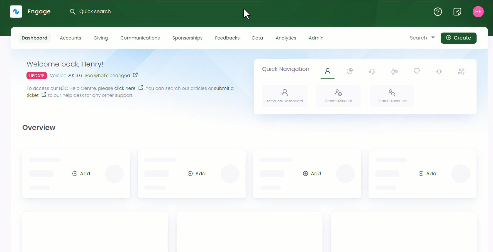
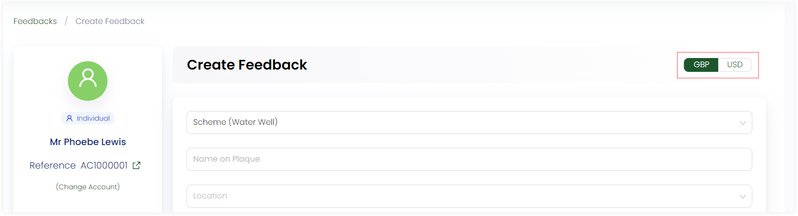
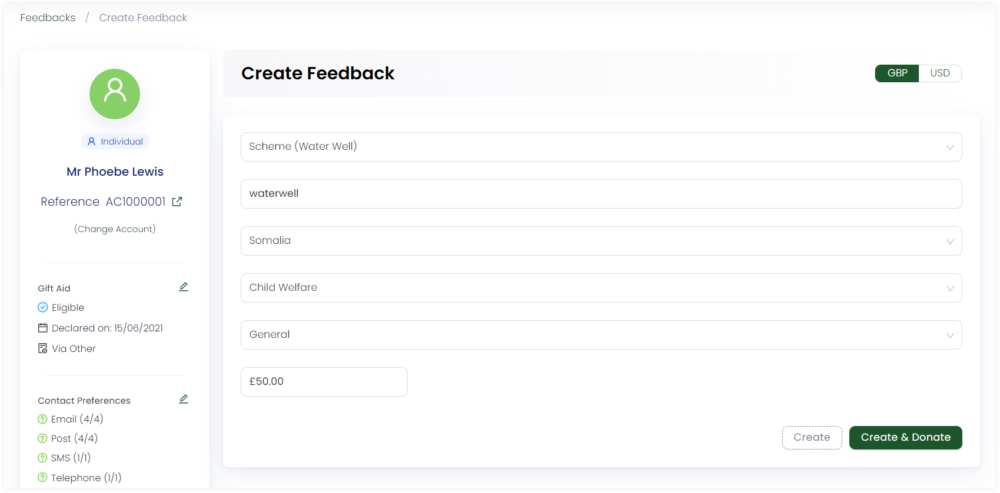

In Engage, an account, whether individual or organization, can create a feedback to donate towards specific projects. This page will walk you through the steps to create a new feedback.

:::note
- By default a feedback is created as anonymous. To associate a feedback with an account, click *Change Account* and choose the account accordingly.
- Before creating a feedback, ask your system administrator to add feedback schemes for you.
- To avoid any duplicate feedbacks and their problems, first <K2Link route="" text="search for a feedback" isInternal/> within Engage.
:::

## Create a New Feedback

1. On the <K2Link route="feedbacks" text="Feedbacks dashboard" isEngage />, navigate to **quick navigation**. Click on **Create Feedback** and a screen will appear to create the feedback.

:::tip
You can also land onto the *Create Feedback* screen via an account. <K2Link route="docs/engage/accounts/searching-accounts/" text="Search for an account" isInternal/>, go to the *Feedbacks* page and click **Add New Feedback**.  
:::

2. On the **Create Feedback** screen, choose any scheme e.g. "New Test Feedback Scheme" and currency e.g. "USD" from the drop-down on the left-hand side.

3. Input *Name on Plaque* and choose location, theme and stipulation.  

:::tip
You can also edit all custom fields and fund dimensions even after creating a feedback. Simply view the feedback in detail and update as per necessary.

:::

4. Specify the price to donate. Some feedback schemes have a fixed price as added by the system administrator therefore, it will be mandatory to donate that amount. 

5. Lastly, click **Create** if you only need to save the feedback or **Create & Donate** if you need to create the feedback and immediately donate towards it. The donation can be made as single or regular donation.
