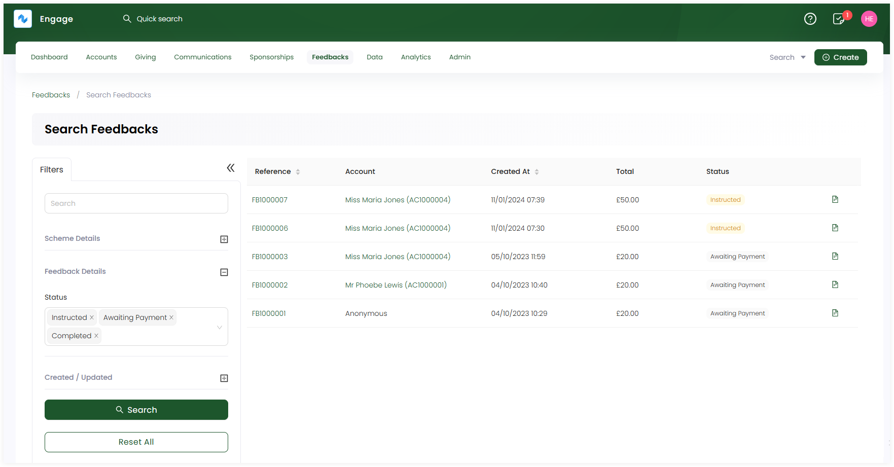

In Engage, feedbacks are donations made by any donor in support of different projects e.g. water wells. This article shows you how to search for existing feedbacks easily with the help of:

- A **quick search box** available in the header at all times allowing you to quickly search for a feedback by **reference**.

- A dedicated **advanced search screen** for advanced searches, such as recently updated feedbacks or with more complex criteria.

## Using Global Search

**1.** On the <K2Link route="dashboard" text="Engage dashboard" isEngage />, click the **quick search box** in the header. If the search scope is not already set to **Feedbacks**, change this from the dropdown on the right.

**2.** Input the search query and select the desired search result. For example, type the reference of a feedback.

:::note Important 
If no results are found for a certain search input, it could be because the feedback does not exist, it might have been cancelled or deleted, or the specific feedback might have moved to another donor.
:::

## Using Advanced Search

The advanced search function is a detailed search option which gives you the leverage to search for any specific type of feedback. You can search for feedbacks that are last modified, having a separate scheme type or other parameters such as date of feedback creation. 

The advanced search screen is made up of a **Filters** panel on the left which you can collapse, and a **results** panel on the right.

**1.** On the <K2Link route="dashboard" text="Engage dashboard" isEngage />, click the **Search** button next to **Create**. Choose the type of search you wish to perform, in this case, **Feedbacks**.

**2.** In the **Filters** panel, modify the search by specifying input parameters accordingly. Click the **+** icon next to the parameters defined in the table below and choose the type of search available.

| Parameters | Description |
| ---------- | ----------- |
| **Scheme Details** | Select the scheme type by choosing from the drop-down. |
| **Feedback Details** | Select the status of the feedback from the drop-down. |
| **Created/Updated** | Input the date at which the feedback was created or modified. You can also select the user who created or modified it. |

:::note
- Feedback schemes are added by your system administrator.
- The date/time in the **Created/Updated** section are relative to the time the user has set on their account.
- You can specify only the **From Date** or the **To Date** and do not need to specify both.
:::

**3.** Click the **Search** button and the results are loaded one page at a time on the right. To get further results, use a **Load More** button at the bottom of the result list.

:::tip
- If you wish to remove the search input for all parameters and start all over again, use the **Reset All** option. 
- If you need a list of all feedbacks or feedback projects, use the lists function.
:::