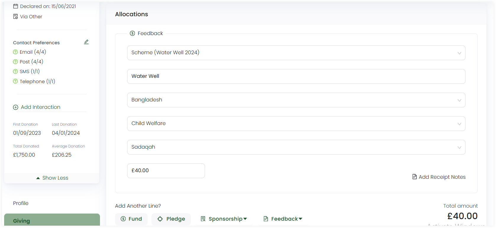

In Engage, once a feedback is created under a particular feedback scheme, the donor can donate towards it at any time. This donation can be both single donation or a regular giving.

To make a donation, follow the steps defined.

1. To donate immediately while creating a new feedback, select **Create and Donate** and navigate to the **Enter Donation** screen. To donate later after saving a feedback, <K2Link route="docs/engage/accounts/searching-accounts/" text="search for an account" isInternal/>, click **Enter Donation** and choose a feedback to donate to via the **Feedback** option in the **Allocations** section.

:::tip
Each created feedback when viewed has different fields and sections defined. For example, for a feedback, if no donation is made towards it, then that feedback would have an **Awaiting Payment** status along with its **Ledger** section as empty.
:::

2. When immediately donating towards a feedback, the created feedback is prepopulated in the **Feedback** tab showing the **reference**, **feedback scheme type** and **fund dimensions** under the **Allocations** section. Similarly, you can also select any **existing** or create another **new** feedback to donate to via the **Feedback** option at the end.

3. The total amount would be the amount donated and shown at the end of the **Allocations** section. Click **Save and Continue to Payment** and pay via the payment methods available in the **Payments** section.

:::tip
To read on how to make payments, go to <K2Link route="docs/engage/donations/payments/payment-types-and-methods/" text="Payment Types and Methods Documentation" isInternal/>.
:::
 