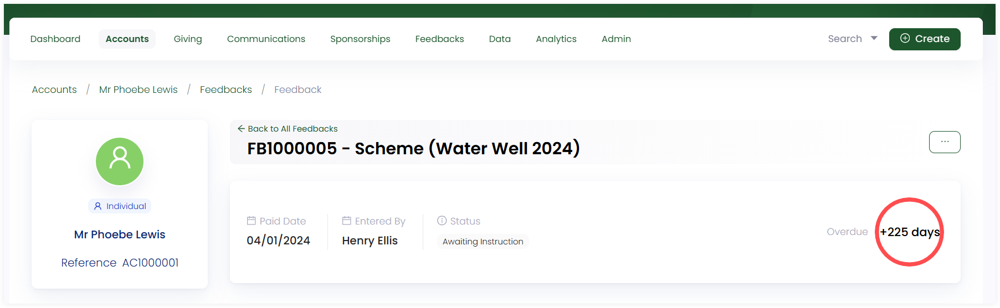
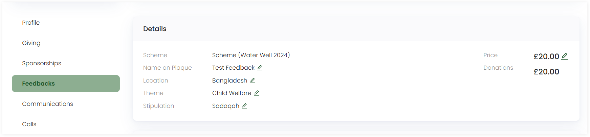
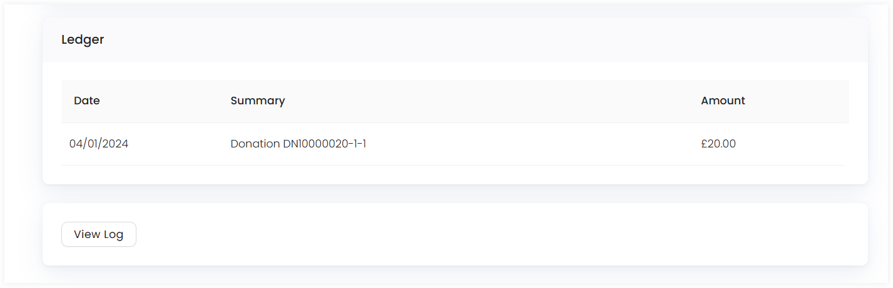
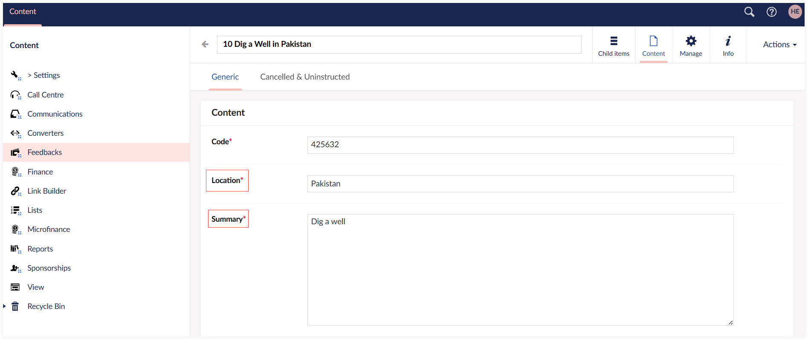

In Engage, you can always view a feedback in detail after its creation. <K2Link route="" text="Search for a feedback" isInternal/> or <K2Link route="docs/engage/accounts/searching-accounts/" text="search for an account" isInternal/> that created a particular feedback, go to the **Feedbacks** page and click the feedback to navigate to the detailed feedbacks screen.

## Detailed Feedback Screen

Within the feedback screen, firstly, you will be able to view:

- Feedback created **date**.
- Feedback creator **name**.
- Feedback **status** including **awaiting payment**, **instructed** or **cancelled**. This depends on the feedbacks progress from time to time e.g. if the feedback payment is not done yet, then it will have the "awaiting payment" status.
- Feedback **Overdue number**. Hover over it and you can see a timeline showing the feedback completion and instruction days as added in the scheme by the administrator.

Secondly, in the **Details** section, you can see the information about the feedback itself including:

- Feedback **Scheme** 
- **Name on plaque**
- **Fund dimensions** (location, theme and stipulation)
- Assigned **price**
- **Donated amount** towards the feedback (if it is already done)

You can edit and update all the custom fields except for donations and scheme.

Then, in the **Ledger** section, you can observe all the donations processed towards the feedback. If no donation has been made, then this part remains empty. You can also skim through the timeline of the feedbacks process starting from its creation till when its instructed and completed. Click the **View Log** button to open up the **Log** pop up screen showing the different stages of the feedback lifecycle.

## Updating Feedbacks Custom Fields

In Engage, feedbacks are fully flexible, allowing you to collect any data related to your projects in the form of custom fields. They enable you to capture and track information that goes beyond the standard data points provided by the CRM. 

These custom fields for a feedback can be in the form of:

1. Name on plaque 
2. Fund dimensions (location, theme and stipulation)
3. Specific separate location for a feedback project to start on

Each of these fields can be edited and updated as per necessary. **Name on plaque** and **fund dimensions** can be edited on the feedbacks detailed screen. 

Fields like **specific location for a feedback** can be edited as part of the feedback project in **Engage Forms**. Navigate to the created feedback project and open up the **Content** tab. Here, you can change the **project location**, **summary**, **start** and **end dates** and **fund dimensions** associated to the project generally. 

