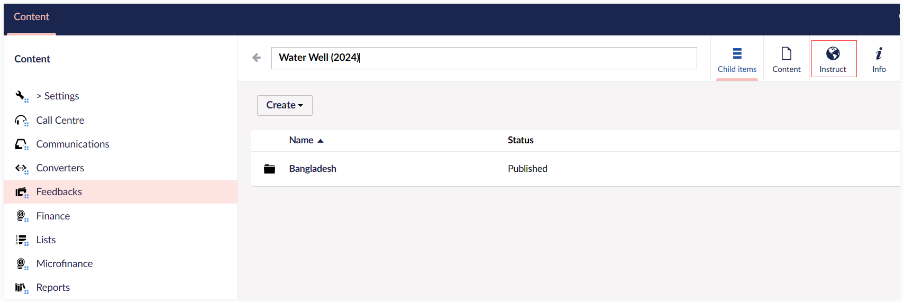
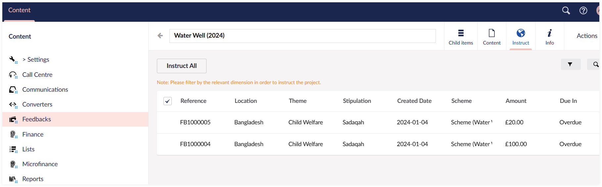
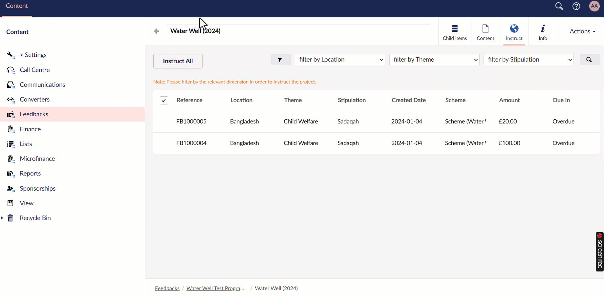
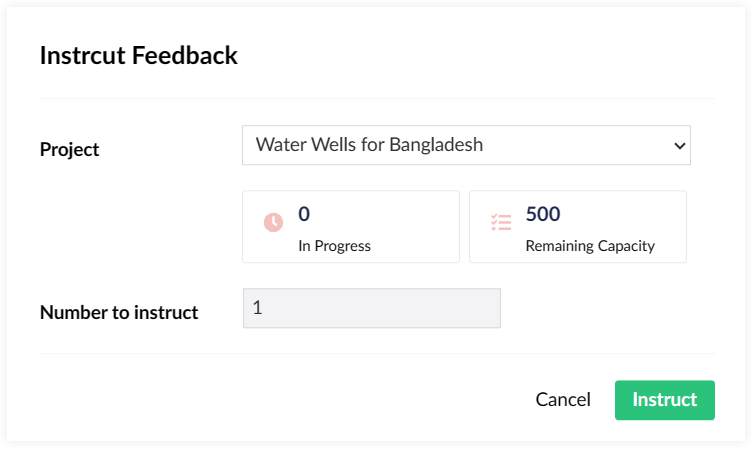
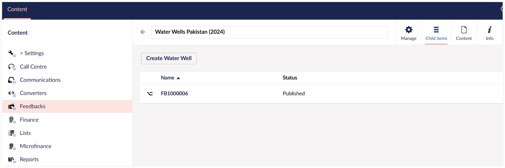
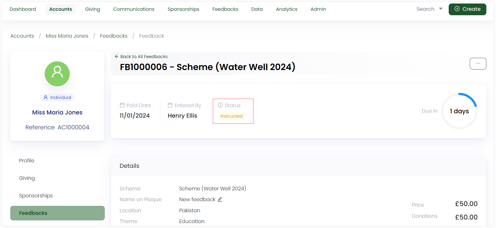

The last step of feedback instruction is to perform the instruction in **N3O Forms (Umbraco)**. Multiple feedbacks created and donated towards in Engage, automatically appear under the **Instruct** tab.  

The **Instruct** tab is under a feedbacks **scheme** because multiple feedbacks might have different locations or themes, hence, one can filter and identify them according to their use. You can instruct a single feedback or more than one, refering to as **bulk feedback instruction**. 

To instruct a feedback:

**1.** Navigate to the **feedback scheme** screen, next to programme, and open up the **Instruct** tab.

**2.** Mulitple feedbacks created in Engage appear with parameters; **Reference**, **Location**, **Theme**, **Stipulation**, etc. 

**3.**  To instruct any feedback, filter and choose the fund dimensions via the **filter icon**, select the feedback to instruct and click **Instruct x**. 

:::tip
- **x** represents the number of feedbacks selected for instruction.
- You can also use **Instruct All** to instruct all the feedbacks.
:::

**4.** On the **Instruct Feedback** screen, select the project to instruct feedback into and click **Instruct**.

:::note
- **Remaining Capacity:** Number of feedbacks to be instructed for a particular project.
- **In progress:** Number of feedbacks that have been instructed for a particular project.
:::

**5.** The feedback instructed would automatically appear in the relevant project under the **Child items** tab. You can click the feedback and view all its information under the **Content** tab.

**6.** As soon as a feedback gets instructed in Umbraco, the status **instructed** would show for the feedback in Engage. 

