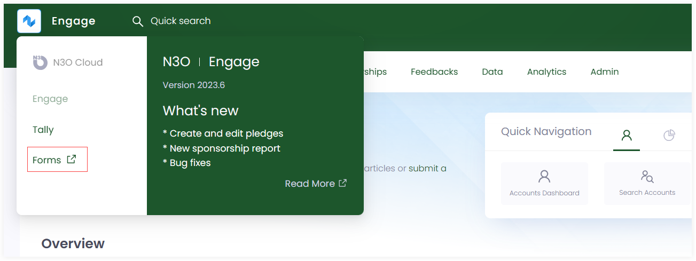
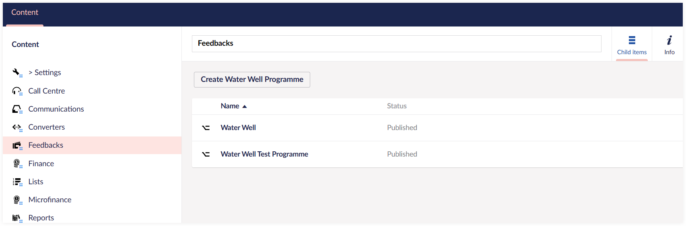
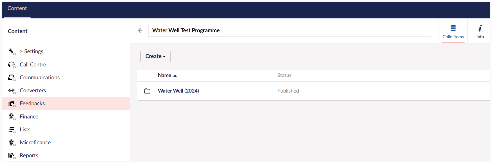
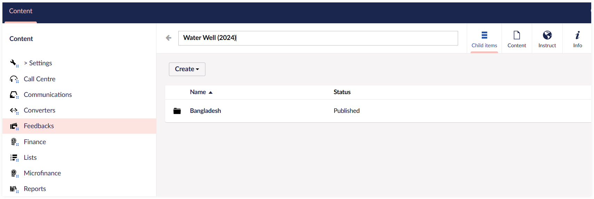
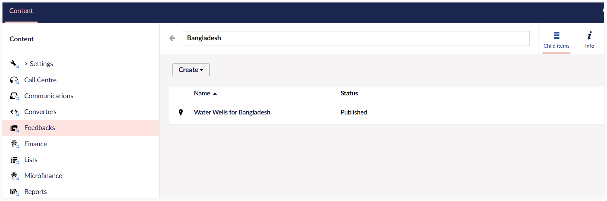
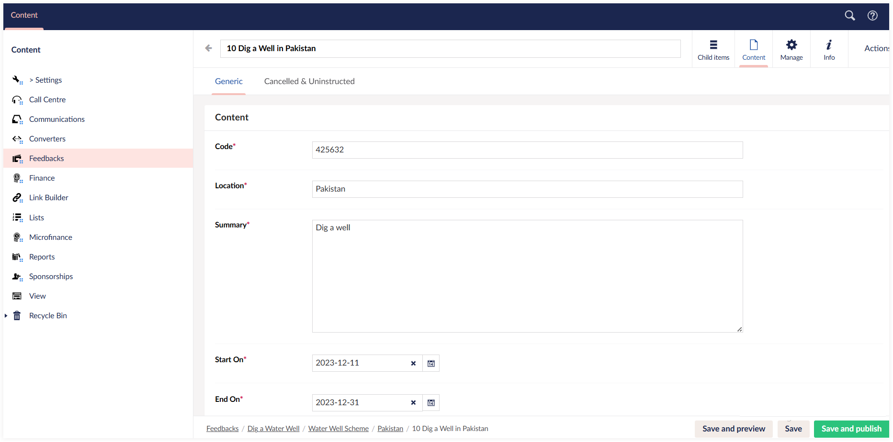

:::tip
Before starting feedback instruction, ask your system administrator to create feedback schemes for you.
:::

Before performing feedback instruction, the first and important step is to create a project in **Engage Forms (Umbraco)**. Each project can be created according to the donor's preference, e.g. *location*, *name* or *scheme*, and includes all feedbacks that are to be instructed.

To create a project:

**1.** Click on Engage and then **Forms** to open up **Engage Forms (Umbraco)**. 

**2.** Click **Feedbacks** under *Content* and create any new **programme** via **Create programme** or choose an existing one.

**3.** Open up the programme and create a new feedback scheme for the programme via **Create**. You can name it according to the scheme created by N3O to avoid any confusion.

**4.** Next, create different folders under the scheme, that can be named according to the scheme's **location**, **theme** or **stipulation**.

**5.** Under any folder, create a **feedback project** via **Create** that includes all details about the feedbacks to be instructed.

**6.** Select the project, click the **Content** tab and add all the required information regarding the project. Each input parameter is described in the table below.

| Input Parameter | Description |
| --------------- | ----------- |
| **Code** | A unique identifier for the particular feedback project. |
| **Summary** | A small paragraph on what the feedback project is about. |
| **Start On** | Start date for the project. |
| **End On** | End date for the project. |
| **Capacity** | <ul><li>Number of feedbacks that can be instructed under a certain project.</li><li> **Note:** If any feedback added exceeds the capacity, then that feedback will not be added in the project. You will need to increase the feedback capacity or create another project. </li></ul> |  
| **Fund Dimensions** | Fund dimensions to be added according to the feedback scheme.  |
| **Notifications** | Once the feedback is instructed, an email is sent to the related person or partner to start working on the project. |

## Adding a Feedback Donation in Engage

As soon as a project is created in Umbraco, the second step is to make a donation towards the related feedback project in Engage. For details on how to make a donation towards any feedback, take a look at the <K2Link route="docs/engage/feedbacks/donating-to-feedback/" text="Adding Donation to a Feedback documentation" isInternal/>. 