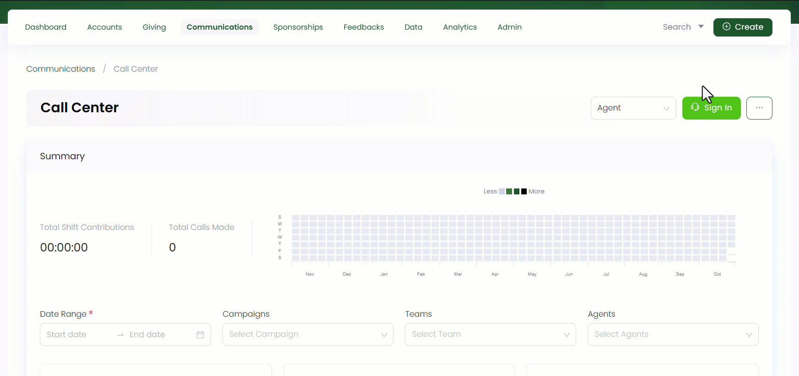
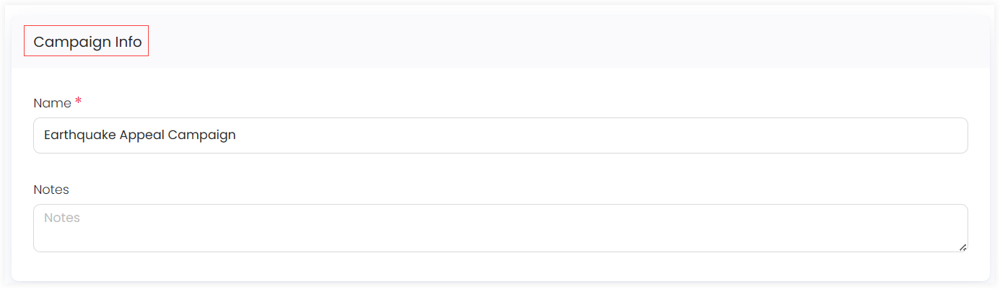
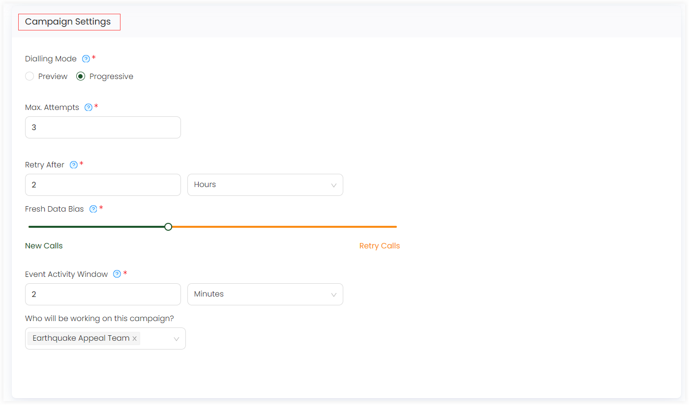
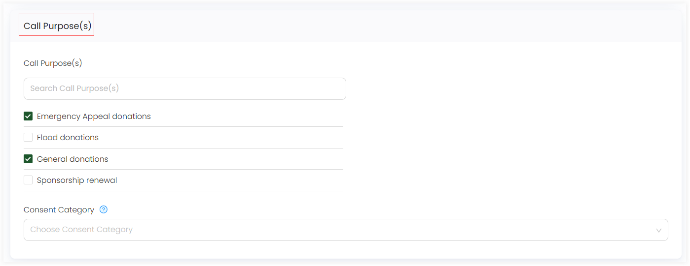
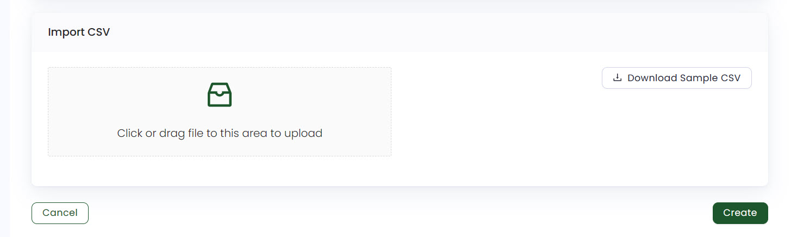

Engage allows you to create new and edit existing campaigns via the call center functionality. 

## Create a Campaign

Follow the steps defined below to create a new campaign.

**1.** Click *Communications* in the top menu bar and then *Call Center* in the quick navigation section to view the *Call Center* screen.

**2.** On the *Call Center* screen, click the **three(...)** dots and select **Manage Teams and Campaigns**. Under the *Campaigns* tab, click the **Create New Campaign** option to land onto the *Create New Campaign* page.

**3.** In the *Campaign Info* section, input the **Name** of the campaign and its **Notes**.

**4.** In the *Campaign Settings* section, input or select the following parameters accordingly.

| Parameters | Description |
| ---------- | ----------- |
| **Dialing mode** | Choose the dialing mode as **preview** or **progressive**. Progressive mode will automatically progress through the data, automatically dialling each record. Preview mode will display each record and allow the agent to decide whether to proceed with the call or not. |
| **Max Attempts** | Time a team member (agent) should be able to attempt to call the same account. | 
| **Retry After** | Time the system should wait until scheduling the next attempt to contact the account about a campaign. Specify the time of each call mode in *Day, Hour, Minute or Month*. |
| **Fresh Data Bias** | <ul><li> When scheduling the next calls in this campaign, prioritize retrying unsuccessful call attempts, or calls to new accounts that haven't been contacted yet by moving the scoller from left to right or vice-versa. </li><li> **Important:** Data bias is defaulted to 20% fresh data, but call center managers tend to change the data bias frequently. If it is made to have only retry calls (0% aur very less) then the agent would get demotivated and not make any calls in the future because retry callers get irritated easily. Hence, calling new donors would mean more donations. </li></ul> |
| **Event Activity Window** | For how long after a call was made should Engage attribute events (e.g. making a donation, starting a sponsorship) to the call. |
| **Who will be working on this campaign?** | The team that will be working on the campaign. | 

**5.** In the *Call Purpose(s)* section, checkmark the **Call Purpose(s)** already shown or search for it in the search bar. Select the **Consent Category** to show whether accounts in a campaign have opted for verbal communications or not and click **Create**.

:::note
- Call purposes are added by your system administrator.
- Accounts that have opted out for a certain consent category would not show in the campaign and become *suppressed*. 
:::

**6.** Under the *Import CSV* section, you can either upload any data CSV file by first filling it up or <K2Link route="docs/engage/communications/call-center/campaigns/connecting-list-with-campaign/" text="connect the campaign with an exisiting list" isInternal/>. Click the *Download Sample CSV* to take a look at the sample file that Engage requires.

## Edit a Campaign

To edit an entire existing campaign, select any *campaign reference* or click the drop-down and choose the **Edit icon** at the end of the campaign row under the *Campaigns* tab. Change any information like *campaign info* or *campaign settings* and click **Save**.

