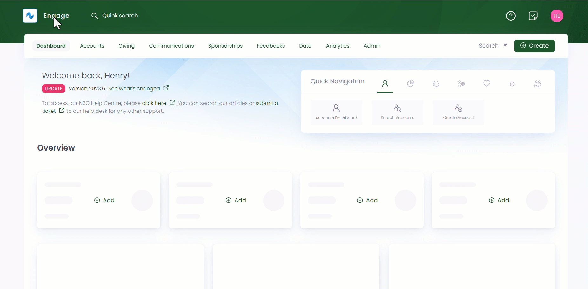
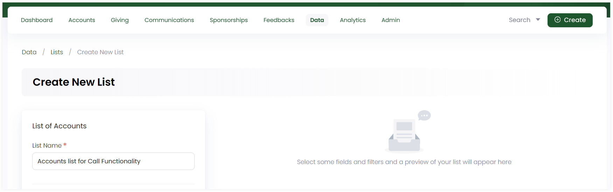

In Engage, before calling any donor, create a new data list or choose an existing and connect it with any active campaign that you are working on.

:::note
To create a new and edit any existing campaign, go to the <K2Link route="docs/engage/communications/call-center/campaigns/creating-editing-campaigns/" text="creating and editing campaigns documentation" isInternal/>.
:::

**1.** Click *Data* in the top menu bar and then *Lists* in the quick navigation section to view the *Lists* screen.

**2.** Click the **+ Create New List** button. Choose the kind of data you want to export in the list from the popup screen *Create New List*, in this case, *Accounts*.

**3.** On the *Lists* screen, input the *List Name* e.g. Accounts list to Call.

**4.** Add different fields to the list which represents the actual data you wish to see on the list. For the accounts list, you need to add the major important fields that are *reference*, *display name*, *primary telephone number* and fields related to call functionality that is *current preference*. Some fields require additional data to be added e.g. current preference requires adding *field title*, choosing the *field channel + category* and giving the consent whether to contact the account as *yes*, *no* or *any*.      

:::info
Each field set has a number of other parameters which can be displayed as per necessary e.g. *address* or *postal code*. You may need not add and display each of them separately in a list.
:::

**5.** You can also add filters to the selected fields of the list to narrow down the results appearing on the right. For the accounts list, it is important that you should add a filter on current preference and select the filter criteria as **opt-in**. Accounts who have opted in for the chosen preference will be displayed only. Click **+ Create New List** and a list of all accounts with fields and filter set will appear on the right.

:::note
It is not necessary to add filters for a field. You can always create a list without a filter set.
:::

**6.** Lastly, you need to connect the list with the *Calls* connection type in order to use it within the call center. To enable the accounts list for calls, click *Connect*. Under the Engage tab, select the connection type e.g. *Calls* and click *Next*. Choose any existing active campaign from the drop-down, select the *entity*, *priority field* and *order*, click the *Should Include International* checkbox and save the connection.

:::note
- Any connection type choosen creates and performs a specified action for each entry in the list.
- Connection types are only available if *reference field* for any list created is selected in the *Fields* section.
- You can leave priority field and order blank as well. 
:::

