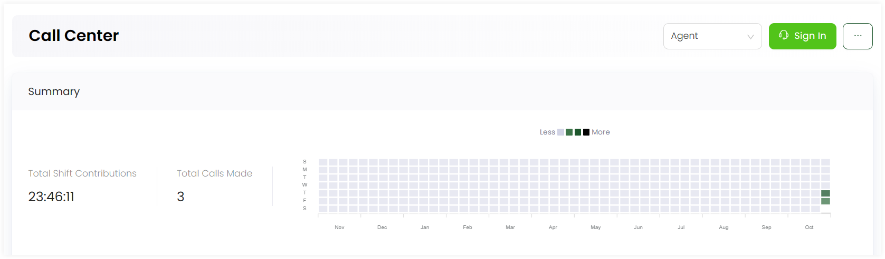
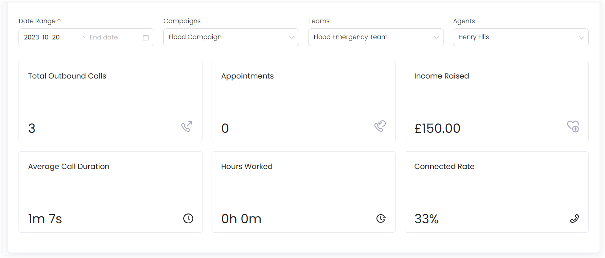

---
title: Dashboard
sidebar_position: 2
---  

In Engage, the **call center dashboard** is basically the main screen of the call center module. It consists of a *Summary* section along with *Live dashboard's* of different active campaigns. To land onto the call center dashboard, click **Call Center** in the quick navigation section of the **Communications** screen.

1. In the **Summary** section, you can view the total calls made or total shift contributions done during a certain time period. This information is also displayed via a graph depicting each week of a month.

:::tip
In the **Summary** section:
- Call center managers can search and view the stats for all the teams, campaigns and agents working. 
- Simple agents cannot view the agents dropdown and can only select their relevant team and campaign from the dropdowns.
- Team leads can only select their relevant team, team members (agents) and campaigns from the dropdown. 
:::

2. You can also select and view different call parameter statistics for a certain campaign, a certain team, selected agent and a specific date range of when the calls were made. 

Each call parameter is explained below.

| Call Parameters | Description |
| --------------- | ----------- |
| **Total Outbound Calls** | Total number of outbound calls made to reach donors. |
| **Appointments** | All appointments scheduled for donors. |
| **Fund Raised** | Total amount of funds/donations raised via the active campaigns over calls. |
| **Average Call Duration** | Average time in minutes and seconds for a certain call duration. |
| **Hours Worked** | Number of hours an agent in a team worked over a certain call. |
| **Connected Rate** | Connectivity rate of a number of calls made to reach donors over a certain campaign. |

:::tip
- Live dashboards appear the moment a user working in a team and active campaign starts calling any donor.
- Call center managers can view live dashboards for all teams and active campaigns. Team leads can view live dashboards for their team **only** and a specific team member (agent) can only view it for the campaign they are working on.
:::

3. In the **Live Dashboard - Campaign name** section, you can view a minimal dashboard dedicated to a currently active campaign consisting of 2 different sections. Upper section includes:

- Number of agents working on a particular day.
- Number of calls handled on a particular day.
- Percentage of the data in calls completed.
- Average duration of a call.
- Income raised by a certain call.

Lower section indicates information about each agent in a team working on an active campaign.

| Parameters | Description |
| ---------- | ----------- |
| **Shift** | Total time an agent worked on a campaign. |
| **Outbound Calls Made** | Number of outbound calls made. |
| **Calls Completed** | Number of calls completed. |
| **Inbound Calls Answered** | Number of inbound calls answered. |
| **Active Campaign** | Name of the active campaign. | 
| **Status** | Current state of the agent. |
| **Income Raised** | Total income/donation raised from calls in a campaign. |

