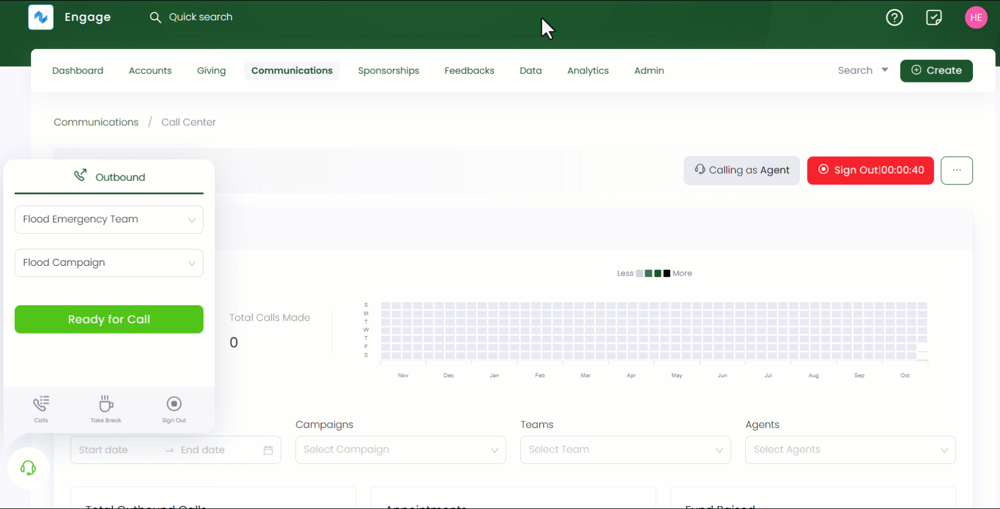

---
title: Calling a Donor
sidebar_position: 3
---  

Call center in Engage allows various dedicated job role users to call different donors at any time. These users can be agents, inbound or outbound callers working in a team under any campaign.

:::note
Job roles are added by your system administrator.
:::

To call a donor, follow the steps defined below.

**1.** Click *Communications* in the top menu bar and then *Call Center* in the quick navigation section to view the *Call Center* screen.

**2.** Select any job role e.g. *Agent* from the drop-down on the right-hand side and click the *Sign In* option. Select the time your shift ends and an extension hour number (if you want to extend your shift) on the *Shift Time Confirmation* screen. Now, you are calling as an agent and signed in for your shift of the day.

:::info
A success popup appears with the message **Success signed into shift**.
:::

:::info
Before dailing a call, make sure that the accounts list is created and connected with any active campaign you are working on.
:::

**3.** In the dailer popup screen, select the team and campaign and click *Ready for Call*. You can make a call on multiple campaigns and your call status will be visible to the call center manager.

**4.** Engage will assign you a donor, displaying the *donor name*, *reference* and *phone number* along with navigating to the donors profile screen where you can make donations and perform other actions. You can choose to call this donor or skip it to get another one providing the *skip reasons*.

:::info
Assigning a donor depends on the campaign's **dailing mode** settings. Engage will allow you to preview a donor before a call if the dailing mode is **Preview** otherwise it will automatically go through the records to make a call in the **Progressive** mode. 
:::

**5.** Start the call with the donor. During the call, you can email the donor through Engage's *Outbox functionality* via *Send Email*, <K2Link route="docs/engage/communications/call-center/calls-appointments/appointments/" text="schedule an appointment" isInternal/> via *Schedule Appointment* or make donations and process payments. As soon as the conversation finishes, you can end the call with any *ended reason* autogenerated by the system.

| Ended Reason | Description |
| ------------ | ----------- |
| **Concluded** | Donor has been spoken to and they will not be called again (or as per your settings when creating the campaign). |
| **Do not call** | Updates the preference, and they should not be called. It will update the preference for whatever the campaign preference was set. For e.g. if you set consent preferences as fundraising, then only the fundraising preference will be changed. |
| **No answer** | Re-scheduled (as to whatever is set on campaign when first created). |
| **Not available** | Re-scheduled. |
| **Wrong number** | Deletes the phone number from account. |

:::info
- Each **ended reason** may or may not have a call disposition. For e.g. selecting *wrong number* removes the phone number of the donor from the campaign list and account information takes you to the **call disposition** containing *account nor answering* or *ended*.
- **Skip reasons** are added by your system administrator.
- If you see **Appointment call** written under the assigned donor's name, it means the system has chosen an appointment call for you. 
- Sometimes when you make a call, the system might give an indication of **Out of Data**. This means that all the donor data has been used, and no more contact is available for a certain campaign.

:::

**6.** Before getting ready for a call on the dialer screen, you can also view all the calls and appointments made via the **Calls** button and take a break with the **Take Break** option. When the break is finished, you can resume your shift with **Resume Shift** dialer option.

**7.** Lastly, when all calls are done, **sign out** from the job role using the *Sign Out* option.

:::tip
Each action done like taking a break or signing out comes with popup messages in the bottom right. 
:::