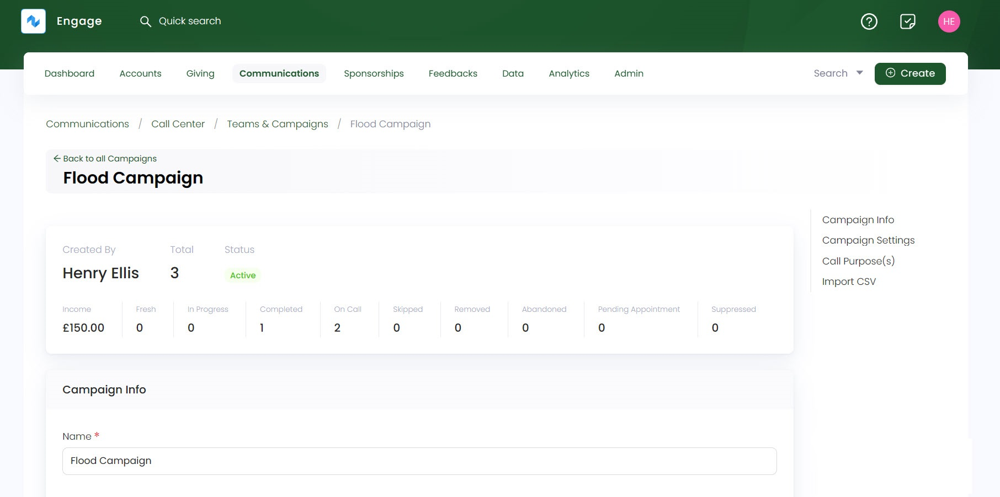
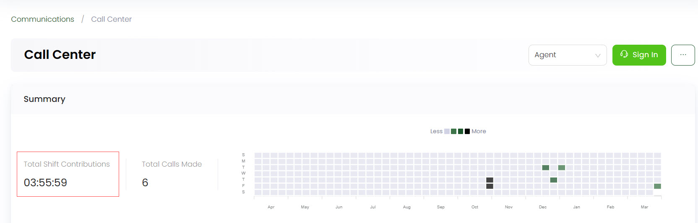

---
title: Statistics
sidebar_position: 4
--- 

Call center statistics refer to quantitative data and metrics that are collected and analyzed to measure the performance and efficiency of various aspects of its operations. These statistics provide insights into key performance indicators (KPIs) and help call center managers make decisions to enhance customer service and optimize processes.

Statistics include:

1. Campaigns being worked on.
2. How the income is raised.
3. How time shift works for agents.

## Campaign Stats

Campaigns as soon as they are created, show certain statistics on the top of every campaign's detail page. Each of them are explained in detail.

:::note
Each campaign has different stats information to show. 
:::

| Statistics | Description |
| ---------- | ----------- |
| **Created By** | Name of user who created the campaign. |
| **Total** | Number of callers called in the campaign. |
| **Status** | Status of the campaign as **active** or **inactive**. |
| **Income** | Amount of donation raised from the campaign. |
| **Fresh** | Number of fresh call records in a campaign. At start, all are fresh but then after making calls they become old. |
| **In progress** | Number of call records that are in a call. |
| **Completed** | Number of call records whose calls have finished. | 
| **On Call** | Number of call records that are in a call. |
| **Skipped** | Number of call records skipped on the dialer. |
| **Removed** | Number of call records whose phone number is deleted from the list, but stays in the system. | 
| **Abandoned** | Number of call records who have been called for a long time but gave no answer, hence got pushed into the abandoned section by the system. |
| **Pending Appointment** | Number of appointments that went above time or did not happen due to any reason. |
| **Suppressed** | Number of records who were in the campaign data list but were opted out so got suppressed for a certain function because the campaign settings for that function were different. | 

## Income Raised

In Engage's call center, donations are raised with potential donors over calls to inspire contributions. This process of effective communication via campaigns helps in building and maintaining trust with donors for long-term success in fundraising efforts. 

Each campaign created allows different team members to call donors for raising donations. The call center manager effectively manages every campaign's settings. One of the settings include the **event activity window** which implies that in a set time period e.g. 4 hours, if any agent persuades a donor to make donations, then that donated amount would be attributed to that call and campaign and added to the income stats.

Each donor called has different attitudes while donating over a call. They might donate immediately during the call or few seconds/hours later after the call. This also depends on the ability of the agent working in a campaign towards the donor. Hence, income/donation raised might be different in various scenarios.

## Time Shift for Agents

Each agent working under a call center must have a visible time shift that they are working on. This means that the agent must specify the number of hours they worked for a certain campaign so that their daily wage can be calculated accordingly and visible to the call center manager.

In Engage, time shift is stated at the start after signing in. Every agent should set the time they signed in, in the format: **hours and minutes**. Hence, the total shift contributions for each agent can be seen on the call center dashboard. 

