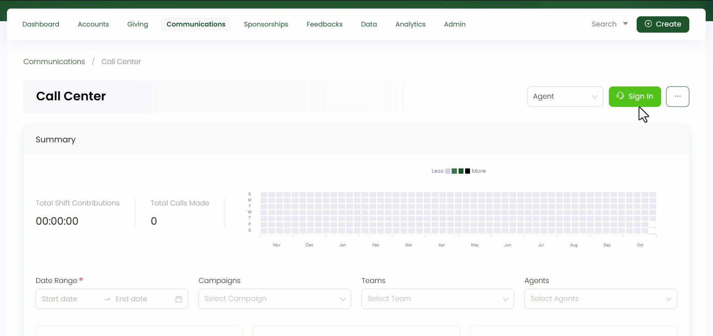

In a call center, campaigns refer to targeted initiatives or projects designed to achieve buisness goals through outbound calling or other communication methods. Certain key aspects of campaigns include:

- **Campaign Objectives:** Each campaign has a clear and well-defined objective. For example, an earthquake energency appeal campaign may aim to raise donations for a sudden earthquake.

- **Target Audience:** Call center campaigns target specific groups of individuals based on demographics, behavior, or other criteria relevant to the campaign's purpose. For example, a customer feedback survey campaign may target recent customers to gather their opinions and experiences.

In Engage, agents, grouped together in teams, can work under various campaigns.

:::tip
Call center managers have access to view and manage all campaigns.
:::

**1.** Click *Communications* in the top menu bar and then *Call Center* in the quick navigation section to view the *Call Center* screen.

**2.** On the *Call Center* screen, click the **three(...)** dots and select **Manage Teams and Campaigns**. The *Campaigns* tab shows a list of all existing active campaigns with defined parameters.

| Parameters | Description |
| ---------- | ----------- |
| **Reference** | Unique identification number of each campaign. |
| **Name** | Name of the campaign. |
| **Created By** | User who created the campaign. |
| **Status** | Current condition of the campaign. |
| **First Call On** | Date on which the first call was made. |
| **Last Call On** | Date on which the last call was made. |
| **Total** | Total number of calls made under a campaign. |
| **Fresh** | Number of new calls made under a campaign. |
| **In Progress** | Number of calls in progress. |

