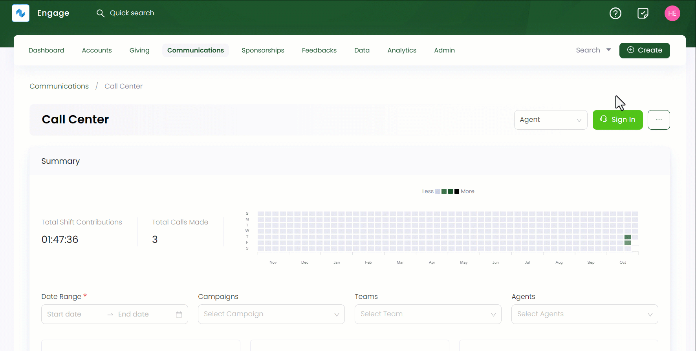
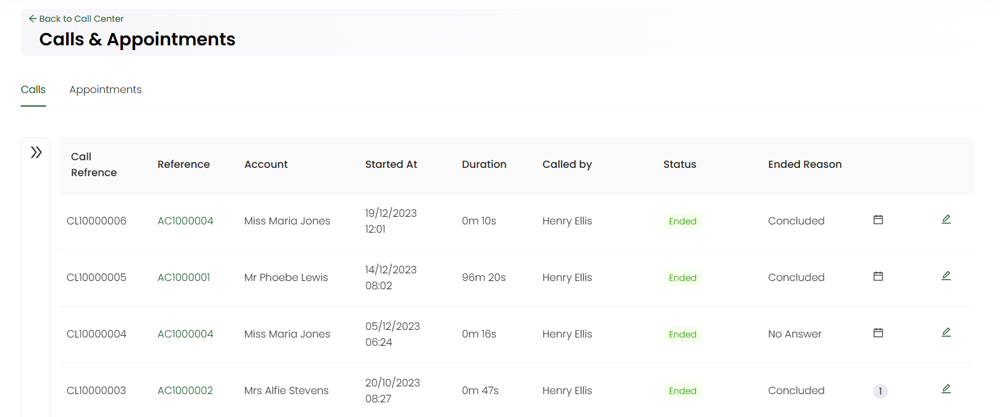

Detailed records of all inbound and outbound calls made by agents can be viewed in the form of a list under the **Calls** section.

:::tip
- Call center managers only can manage and edit the calls for all teams and campaigns.
- Team leads can only edit calls for their relevant teams.
:::

**1.** Click *Communications* in the top menu bar and then *Call Center* in the quick navigation section to view the *Call Center* screen.

**2.** On the *Call Center* screen, click the **three(...)** dots and select **Calls and Appointments**. You will be able to view a list of calls under the *Calls* tab.

**3.** The calls list includes following parameters.

| Parameters | Description |
| ---------- | ----------- |
| **Call Reference** | Reference number of each call. |
| **Reference** | Reference number of the account that has been called. |
| **Account** | Account name to whom a call was made. |
| **Started At** | Time and date a call was made. |
| **Duration** | Time duration a call lasted for. |
| **Called by** | Agent who started the call. |
| **Status** | Status of the call. |
| **Ended Reason** | Reason a call was ended. |

:::tip
You can also hover over symbols that either show minimal details for any *appointment* or *call ended/disposition reasons*.  
:::

## Editing a Call

You can also edit and update any existing call from the list. 

**1.** Click the *pen icon* located at the end of any selected call row. An *Update Call* screen pops up from the left-hand side with all the call information.

**2.** Change any information you want to e.g. the call ended reason or call purpose and click **Save**.

## Searching a Call

You can also search for a call in the list using the **Filters** panel on the left. 

**1.** Expand *Filters* and specify any parameter defined in the table to search for the exact call.

:::info
The **caller option** is shown to a *call center manager* and *team lead* **only**, not a simple agent or team member. Simple agent only has a list of his or her own calls that have been made. Manager has a list of all callers and campaigns and team lead only has a list of himself and all agents present in his/her team.
:::

| Search Parameters | Description |
| ----------------- | ----------- |
| **Keyword** | Specify any keyword to search a call e.g. call reference. |
| **Caller** | Select any caller that made a call. |
| **Date and Time** | Input the date and time at which the call was made. | 
| **Campaign** | Select the campaign under which the call was made. | 
| **Ended Reason** | Select a reason that made a call end. | 
| **Call Direction** | Checkbox whether the call was inbound or outbound. |
| **Phone Number** | Input the phone number of the account to whom the call was made. |
| **Account Reference** | Input the account reference. |
| **Has Appointment** | Checkbox whether the call had a scheduled appointment or not. | 

**2.** Click the **Search** button and the results are loaded *"one page"* at a time on the right. Use a **Load More** button at the bottom of the result list to get further results.

:::tip
- You can specify the *From Date* or the *To Date* and do not need to specify both. 
- If you wish to remove the search input for all parameters and start all over again, use the **Reset All** option. 
:::