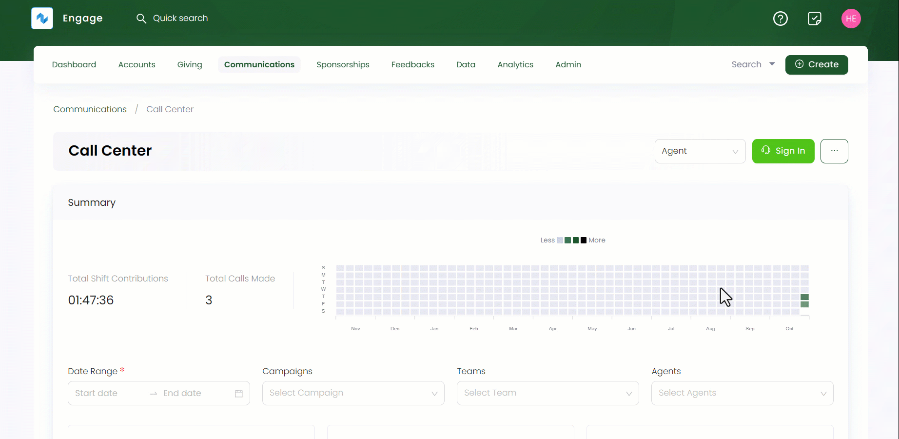
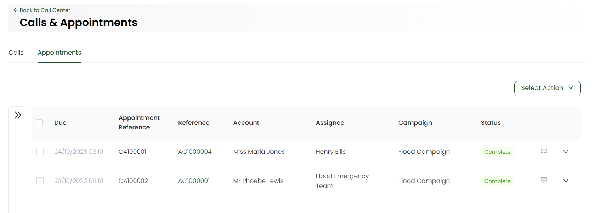

In Engage's call center, you can view records of all scheduled appointments for various accounts in the form of a list.

:::tip
- Call center managers **only** can manage and edit appointments for all campaigns.
- Overdue appointments are distinguished with a *red colour* along with a message *'There are x overdue appointments'* on the top.
:::

**1.** Click *Communications* in the top menu bar and then *Call Center* in the quick navigation section to view the *Call Center* screen.

**2.** On the *Call Center* screen, click the **three(...)** dots and select **Calls and Appointments**. You will be able to view a list of all appointments under the *Appointments* tab.

**3.** The appointments list includes following parameters.

| Parameters | Description |
| ---------- | ----------- |
| **Due** | Time and date an appointment is due on. |
| **Appointment Reference** | Reference number of each appointment. |
| **Reference** | Reference number of the account that has been made an appointment with. |
| **Account** | Account name that has been made an appointment with. |
| **Assignee** | Time duration a call lasted for. |
| **Campaign** | Name of the campaign related to the appointment call. |
| **Status** | Status of the appointment call. |

:::tip
You can schedule or create a new appointment with any donor while <K2Link route="docs/engage/communications/call-center/calling-a-donor/" text="starting a call with them" isInternal/>. As soon as it is created, it appears in the **Appointments** section.   
:::

## Reassigning or Rescheduling an Appointment

You can reassign or reschedule an appointment if: 

1. It did not happen on the scheduled time
2. The account called was busy
3. The appointment got cancelled for some reason
4. The assigned user started working on another campaign 

Simply click the **down arrow** at the end of the selected appointment row and choose *Reassign* or *Reschedule*.

## Canceling an Appointment

You can also cancel a scheduled appointment. Click the **down arrow** at the end of the selected appointment row and choose *cancel*. Input the reason to cancel in the *Cancel Appointment* popup screen and click *Cancel*.

## Searching an Appointment

You can also search for an appointment in the list using the **Filters** panel on the left. 

**1.** Expand *Filters* and specify any parameter defined in the table to search for the exact appointment.

| Search Parameters | Description |
| ----------------- | ----------- |
| **Keyword** | Specify any keyword to search an appointment e.g. reference. |
| **Assignee** | Select an assignee who made an appointment. |
| **Date and Time** | Input the date and time at which the appointment was made. |
| **Status** | Select the status of an appointment. | 
| **Overdue** | Checkbox if an appointment is overdue or not. | 

**2.** Click the **Search** button and the results are loaded *"one page"* at a time on the right. Use a **Load More** button at the bottom of the result list to get further results.

:::tip
- You can specify the *From Date* or the *To Date* and do not need to specify both. 
- If you wish to remove the search input for all parameters and start all over again, use the **Reset All** option. 
:::