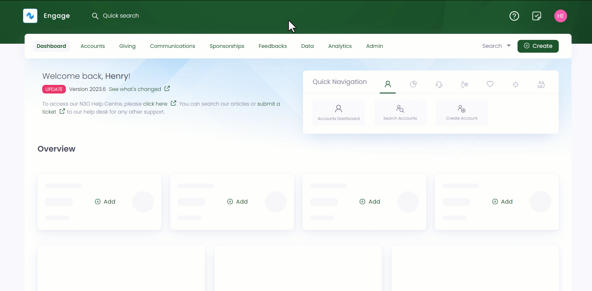
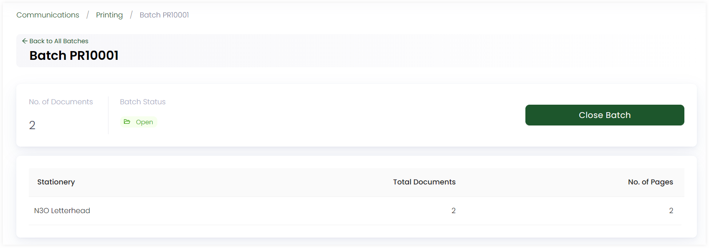

In Engage, printing allows a user to set and action **print batches**. A print batch, including receipts, certificates and letters, is grouped together by similar print tray sizes to print communications in one go. When multiple documents (emails, SMS, receipts, PDFs) are auto-generated via the trigger and action mechanism, they are added to a print batch for printing together whenever ready. 

A single print batch can consist:

1. Up to 500 pages of PDF documents.
2. Documents generated in the same physical office.
3. Documents having same letterhead (so that you can print the whole batch from the same print tray).

:::tip
Documents having different letterheads and physical offices will be printed in different batches.
:::

## Batch States 

After assigning documents to be printed in batches, they can have 3 states as defined.

1. **Open:** The batch is available to receive additional documents for print. Every time a document is generated, which matches the criteria for this batch, they will be added.
2. **Awaiting Print:** The batch has been closed by the user, so it will not receive any additional documents. This is a holding state, that waits for the user to print the documents.
3. **Printed:** The batch has been printed and has been *marked as printed* by the user. This is in a complete state, but can still be accessed. 

## How to Print a Batch?

To print a batch of newly created documents, follow the steps defined.

:::note
Before populating print batches, ask your system administrator to set up **PDF templates**, **layouts** and **stationary items** for you.
:::

**1.** Click **Communications** in the top menu bar and then **Printing** in the quick navigation section to view the **Printing** screen.

**2.** Observe a list of existing batches for printing with different parameters as described below. You can also search for a specific print batch via the **Filters** panel on the left. Expand the panel and input the **reference** of any print batch to view the specific one.

| Parameters | Description |
| ---------- | ----------- |
| **Reference** | A unique reference number for a batch. |
| **Batch Period** | The date period along which the documents were added in a batch. |
| **Number of Documents** | The total number of documents in a batch. |
| **Queue** | The type of queue for a batch. |
| **Print Status** | The status of the batch. | 

**3.** For batches in an **Open** batch status and ready to be sent for printing, click **Close Batch** to ensure no further documents can be added in it.

**4.** The batch now moves to the **Awaiting Print** status where you can download the document, send it for printing and click **Mark Batch as Printed** to avoid any duplicate printing and set the status of that print as ***Printed***. 

:::tip
For print batches already in the **Awaiting Print** batch status, repeat step 4 and send it for printing.   
:::

