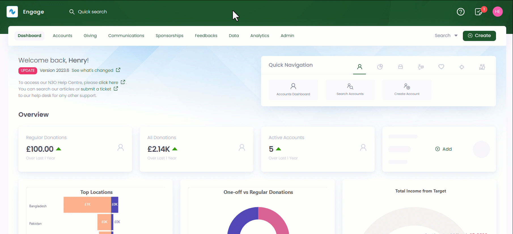
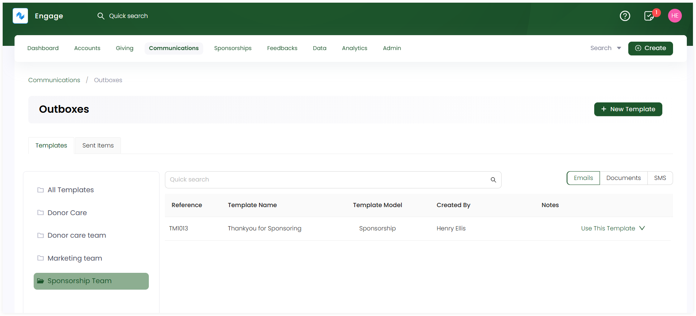

In Engage, an outbox is used for sending ad-hoc correspondence (email, SMS, or document) to an account. For example, a payment delivery is failed, or a sponsorship is due for renewal. These correspondences can be sent via two ways:

1. To one account at a time manually
2. To different accounts automatically for a similar purpose in bulk via lists

:::note
To add an outbox and its functionality, ask your system administrator to that for you.
:::

You can view existing outboxes representing different entities such as sponsorships or feedbacks in the **Outboxes** screen, also known as the **Outboxes dashboard**. For example, *all emails, documents or SMS related to sponsorships will be handled under the Sponsorship Outbox*.

**1.** To land onto the **Outboxes** screen, click **Communications** in the top menu bar and then **Outboxes** in the quick navigation section.

 
**2.** Each outbox includes two tabs, **Templates** and **Sent Items**. 

- **Templates** include all created documents (emails, PDF, SMS) that need to be sent to the donor in the form of a list. 
- **Sent Items** includes all the documents that were successfully sent to the respective donors. You can also select the time period during which the documents were sent to respective accounts e.g. **last 7 days**, **last 30 days** or **all time**.  

:::note
You can use the **toggle button** on the right-hand to switch between different templates.
:::

The table defined below shows the different parameters for created documents.

| Parameters | Description |
| ---------- | ----------- |
| **Reference** | Unique identification number of a template. |
| **Template Name** | Name of a template. |
| **Type** | Type of template used. |
| **Created By** | User who created a template. |
| **Notes** | Any notes added in the template. |

