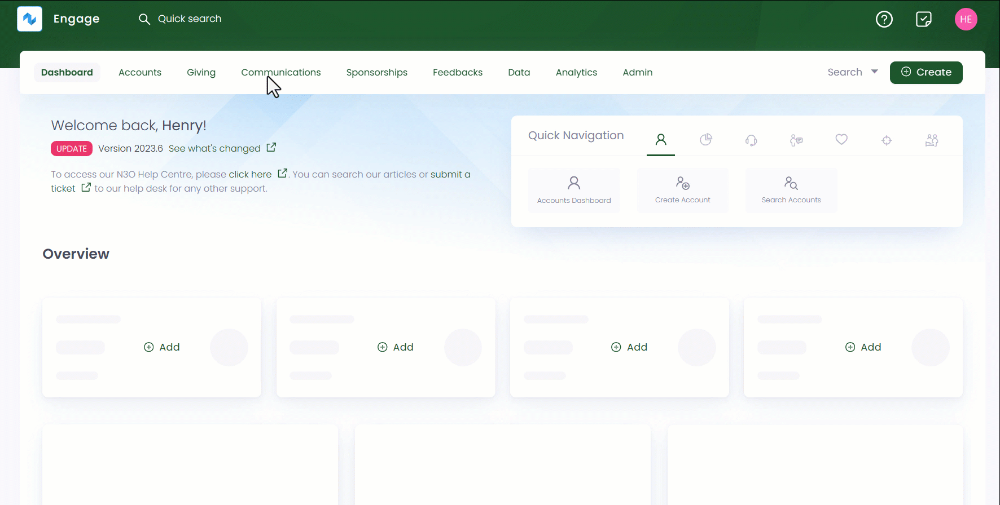

In Engage, an outbox is used for sending ad-hoc correspondence (email, SMS, or document) to an account for e.g., a payment delivery is failed, or a sponsorship is due for renewal. These correspondences can be sent via two ways:

1. To one account at a time manually
2. To different accounts automatically for a similar purpose in bulk via lists

:::note
To add outboxes and its functionality, as your system administrator to that for you.
:::

You can view all existing outboxes in the outboxes dashboard screen representing different departments for e.g. all emails, documents or SMS related to sponsorships will be handled under the *Sponsorship Outbox*.

1. Click *Communications* in the top menu bar and then *Outboxes* in the quick navigation section to view the *Outboxes* screen.

 
2. Each outbox includes two sections, *Templates* and *Sent Items*. Templates include all documents in the form of a list with parameters defined below. Sent items includes the time period of when the documents were sent to respective accounts e.g. *last 7 days*, *last 30 days* and *all time*. These documents are displayed in the form of a list. 

:::note
You can use the *toggle button* on the right-hand to switch between different templates.
:::

| Parameters | Description |
| ---------- | ----------- |
| Reference | Unique identification number of a template. |
| Template Name | Name of a template. |
| Type | Type of template used. |
| Created By | User who created a template. |
| Notes | Any notes added in the template. |

