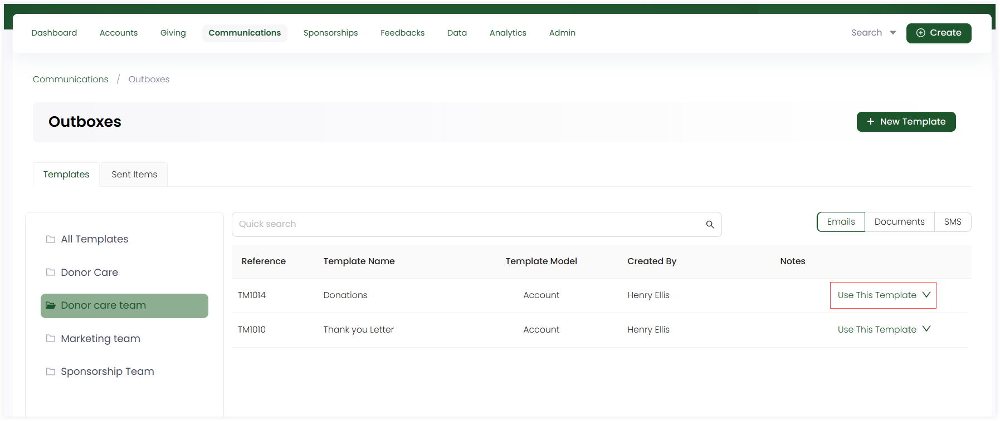

As soon as you create a new template, you can manually send it to the respective donor immediately.  

**1.** On the **Outboxes** screen, choose an outbox, then select any template (email, SMS or document) and click **Use This Template**. 

**2.** This will lead you directly to the **Send Email, Document or SMS** screen. You can also click the **down arrow** and use other options like:

- **Edit:** Update the template and save it. 
- **Delete:** Remove the template completely and add a new one instead.
- **Deactivate:** Remove the template for sometime and come back to use it later.

**3.** Follow the steps respective to each template and click **Send**. 

### While sending an email:

**1.** Search and select any **recipient account**. 

**2.** Select the **entity type** to send from the options given. This depends on the **template model** that you select while adding the email template. For e.g. *template model type account does not require step 2 to be performed for an email*.

**3.** Add any additional documents or **attachments** to the template. This is an optional step.

**4.** Preview the template via **Preview** option.

### While sending a document:

**1.** Search and select any **recipient account**.

**2.** Select the **entity type** to send from the options given. This depends on the **template model** that you select while adding the document template. For e.g. *for a donation type template model, select which donation you want to add in the document to be sent*.  

**3.** Add any additional documents or **attachments** to the template. This is an optional step.

**4.** Preview the template via **Preview** option.

### While sending an SMS:

**1.** Search and select any **recipient account**.

**2.** Select the **entity type** to send from the options given. This depends on the **template model** that you select while adding the SMS template. For e.g. *for a account type template model, select which account you want to add in the SMS to be sent*.  

**3.** Add any additional documents or **attachments** to the template. This is an optional step.

**4.** Preview the template via **Preview** option.

