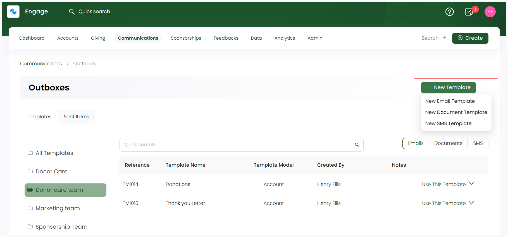
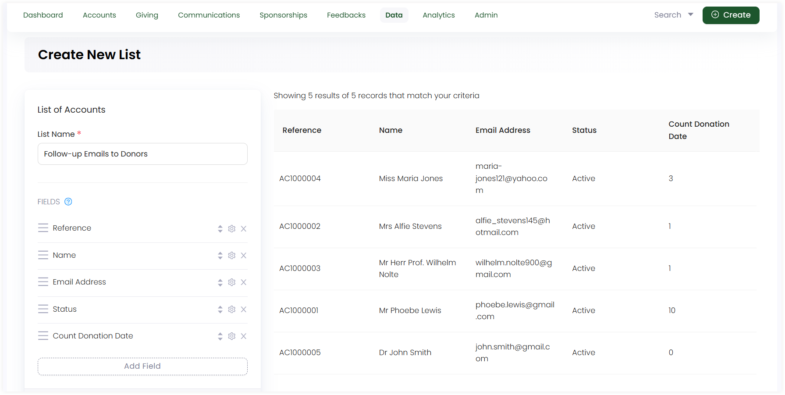
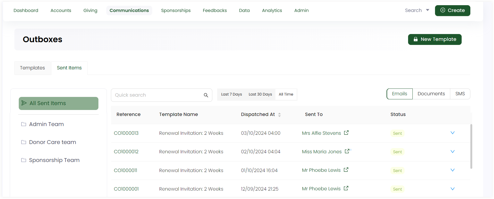
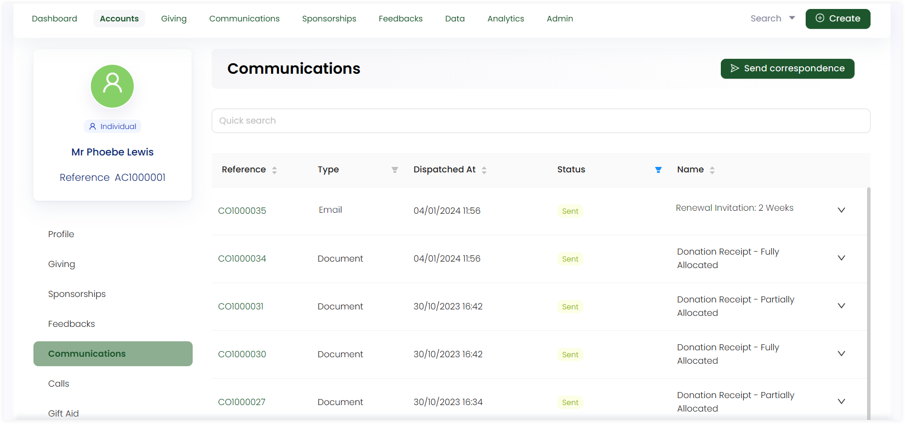

---
title: Send Templates in an Outbox Automatically via Lists
sidebar_position: 4
--- 

Instead of manually sending templates (email, document, or SMS) created in an outbox to each donor individually, Engage allows you to send them automatically and periodically using lists. This helps save time and enhance donor engagement within the CRM.

In this guide, let us look at how to send any created template to a donor via lists.

## Create a Template in an Outbox

The first step is to create an **email template** in an outbox. 

**1.** Click on **Communications** in the header menu and then **Outboxes** to navigate to the **Outboxes dashboard**.

**2.** Choose an **outbox** and create any new **template** (email, document or SMS). You can also use any existing one. To learn how to create one, go to the <K2Link route="docs/engage/communications/outboxes/creating-templates-in-outbox/" text="Create Templates in an Outbox documentation" isInternal/>.

## Connect the Template with a List  

The next step is to create a list and connect it with the outbox containing the template. 

**1.** Click on **Data** in the header menu and then **Lists** to navigate to the **Lists dashboard**.

**2.** Create a separate folder if you want under **My List** and then create a list with any type. *For example, if you are sending a follow-up email regarding any query to a donor, select type "Account"*.

**3.** Input the **list name** and populate the list **fields** and its **filters**. Be sure to include **Email address** as a field as we are dealing with sending out templates to donors.

**4.** When the list is created, first, set it to **auto-refresh** so that the list can update any new data coming in. Then, click **Connect**, select the connection type as **Correspondence**, choose **type** from the **"Send at most one correspondence per"** dropdown and tick the checkbox **Ignore Preferences**. Click **Next**, select the **template** you created before under the specific outbox and click **Save Connection**.

## Send Templates to Donors Automatically

As soon as the connection is set for the created list, Engage will start sending out templates automatically to all the donors. To view whether templates have been sent or not, you can either:

- Click **Outboxes**, select **Sent Items** tab and see all emails sent under time period **All Time**.

- Or, navigate to the respective donors profile, click **Communications** in the profile menu and look at all the sent templates.

