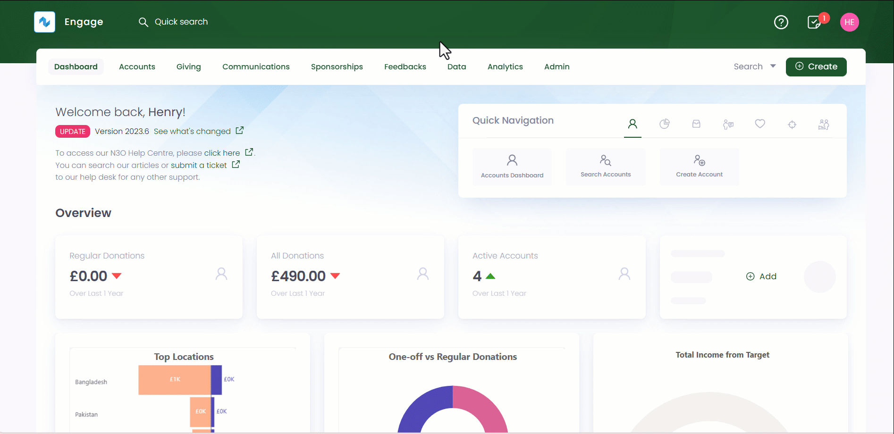

In Engage, an inbox is used for **reviewing** multiple **feedback and sponsorship reports** in one place. It's functionality is similar to and synced with the <K2Link route="docs/forms/content-section/reports/" text="Reports section" isInternal/> under **Engage Forms**. 

Reports created in Umbraco (Engage Forms) for any beneficiary sponsored or feedback created, automatically appear under the **Inboxes dashboard** in Engage. Hence, donors can review awaiting reports directly within Engage as well. Similarly, with a single report, you can:

- Either **review** the report and **reject** it for any reason.
- Or **review** the report, change the report **due date**, if needed, and **approve** it accordingly.

:::tip
To utilize the inbox functionality, feedback and sponsorship schemes must be created beforehand.
:::

## Review Reports in an Inbox

**1.** To land onto the **Inboxes** dashboard, click **Communications** in the top menu bar and then **Inboxes** in the quick navigation section.

**2.** Multiple pre-existing sponsorship and feedback schemes created appear on the left hand side. Each scheme is shown as an inbox with name **"Scheme Type: Scheme Name"**, e.g. *"Feedback: Build a Classroom"*. 

**3.** Click on any scheme inbox and view the report from start to end to review it. **Reports with only "Awaiting Review" status are displayed**. You can:

- Either click on the **report reference** and approve or reject it accordingly via the **Approve** option.
- Or, click the **Start Review** button and approve or reject it accordingly via the **Approve** option.

**4.** The report detailed review screen shows:

- **Name** of the report which can be edited accordingly.
- **Submitted Date**, **Submitted By**, **status** of the report as **awaiting review**  and **due date** in days.
- Report **preview** tab along with a **history** tab demonstrating a timeline of mulitple actions performed on the report.
- An **Approve** option to approve the report directly.
- **Three dots** indicating **rejecting** the report or change it's **due date** to further extend it. 

**5.** Multiple reports can appear under a **single** inbox in the form of a table with following parameters.

| Parameters | Description |
| ---------- | ----------- |
| **Reference** | The unique identification number of the report. |
| **Name** | The name of the report. |
| **Status** | The status of the report as **Awaiting Review**. | 

