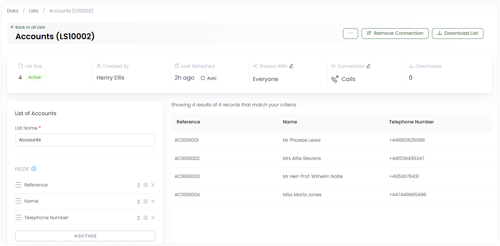
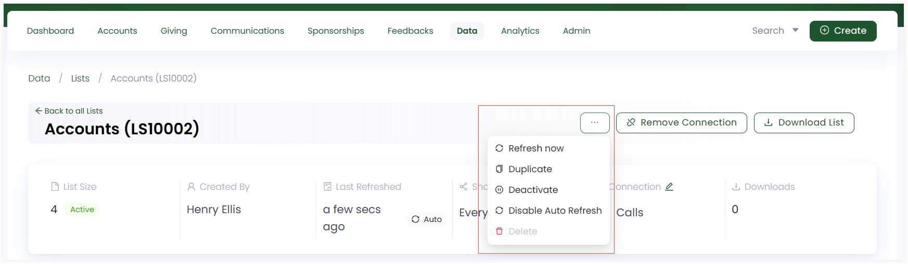

Similar to creating lists, you can view and update an existing list within Engage. 

**1.** Click *Data* in the top menu bar and then *Lists* in the quick navigation section to view the *Lists* screen.

**2.** Click *list reference* to view a detailed version of any existing list including following.

- **List Size:** The total number of records within the list.
- **Created By:** User who created the list.
- **Last Refreshed:** The last time when a particular list was refreshed. 
- **Shared With:** The users with whom the list is shared with. You can click the *pen icon* to set the list with *private*, *available to all* or *only selected users* sharing option.
- **Connections:** The connection type with which the list is connected. 
- **Downloads:** The number of downloads for the list.

**3.** You can also view all the records present in the list in the form of a table and their *selected fields* plus *filter sets* on the left-hand side. 

**4.** To update the list, edit any field or filter set with the *edit icon* or any information regarding the connection and click *Update List*.

**5.** To explore more options regarding the list, click the **three dots (...)** and you can perform the below functions.

- Refresh a list anytime with the **Refresh Now** option.
- Create a duplicate of a list via **Duplicate**.
- Deactivate the list by clicking **Deactivate**.
- Enable and set a list to auto refresh with **Enable Auto Refresh** option.

   