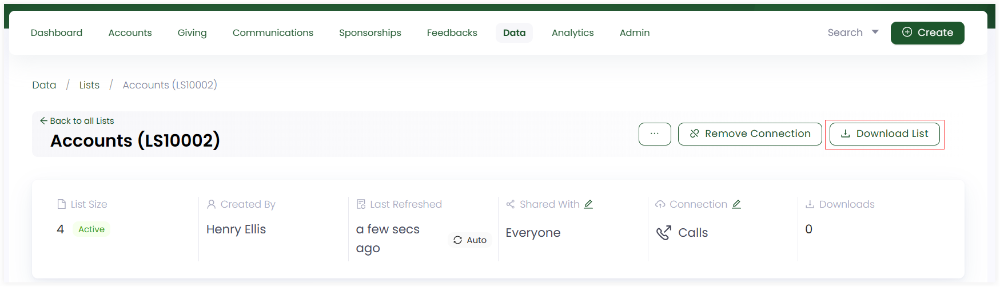
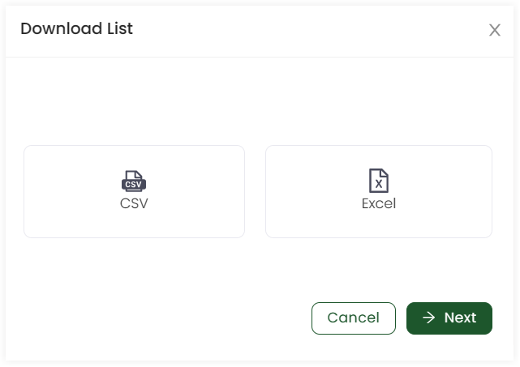
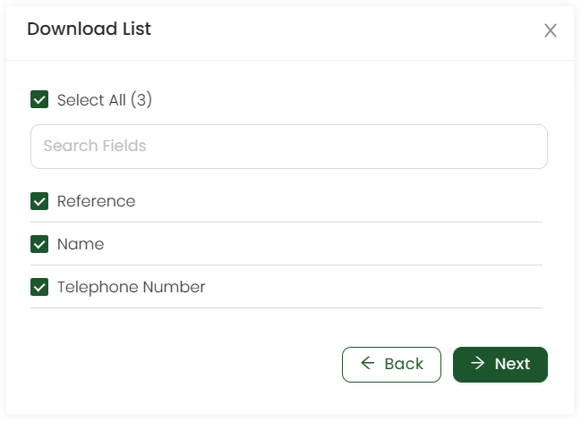
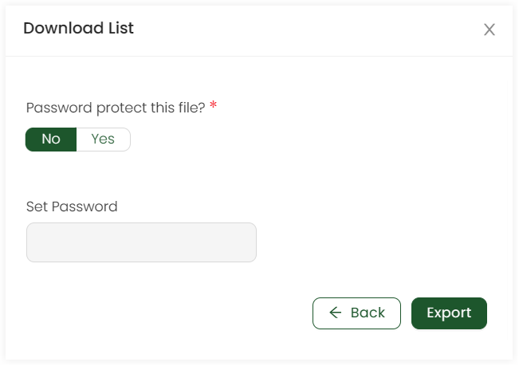
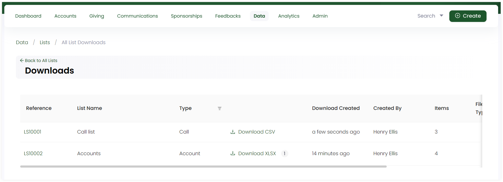

In Engage, you can download any existing or newly created list in the form of *CSV* or *Excel* files.

**1.** Click *Data* in the top menu bar and then *Lists* in the quick navigation section to view the *Lists* screen.

**2.** Click *list reference* to view a detailed version of any list and click *Download List*.

**3.** Select whether to download as *CSV* or *Excel* and click *Next*.

**4.** Now, choose the fields that you want to include in your downloaded file or tickmark *Select All* and select *Next*.

**5.** Lastly, choose whether you want the downloaded file to have password protection as *yes* or *no*. If **yes**, then set the password and click *Export*. 

:::note
This option is only available for downloading *Excel* files.
:::

## View All Downloaded Files

As soon as a list is downloaded, you can view it in the *Downloads* section. Click *Downloads* on the *Lists* screen and view all the downloads in the form of a table with defined parameters. To download, click the *Download XLSX* or *Download CSV* for any list.  

| Lists Parameters | Description |
| ---------------- | ----------- |
| Reference | Reference number of the downloaded file. |
| List Name | Name of the list downloaded. |
| Type | Type of the list downloaded. |
| Downloaded Created | Date and time the list was dowloaded. |
| Created by | Name of user who downloaded the file. |
| Items | Number of records in a downloaded file. |
| File Type | Type of file downloaded. |
| Downloaded by | Logo of user who downloaded the file. |

