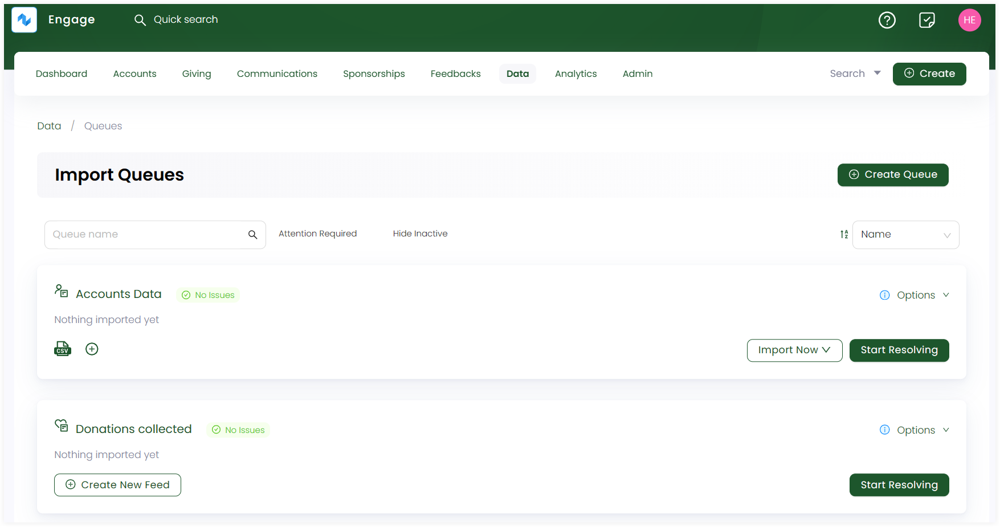

Queues are important in terms of importing data into the system from different data sources. Engage allows you to bulk import mulitple data feeds in queues and then group them together. A feed is classified as a template for importing data from a *CSV* or *JSON* data source.  

The *Imports dashboard* is basically the queues dashboard. To land onto the queues dashboard, click *Data* in the top menu bar and then *Imports* in the quick navigation section. The *Import Queues* screen contains records of all new or existing queues created.

:::tip
You can create any new queue or search it in the search bar located on the top.
:::

Each queue displayed has:

1. A *name* dedicated to the queue for which you are importing data.
2. Number of records showing a status like *error*, *unmatchable records*, *no issues* or *warnings*.
3. *Date* on which the last data was imported. If nothing is imported, then *Nothing imported yet* is displayed.
4. Number of *CSV* or *JSON* feeds created. 
5. An *Import Now* option to import data into an existing feed (template). If feed is not created, then this option will not appear.
6. A *Start Resolving* option to automatically get the next available record which requires your attention and start resolving issues.

