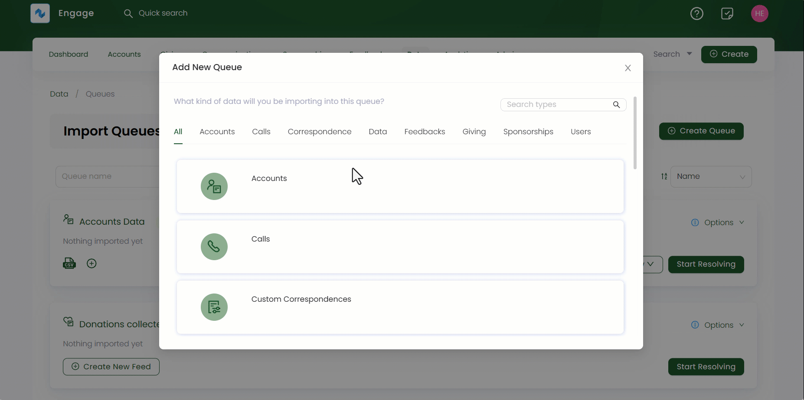

Engage allows you to create a queue to import any data from multiple data sources within the system. Follow the defined steps to create a new queue.

1. Click *Data* in the top menu bar and then *Imports* in the quick navigation section to view the queues screen.

2. On the *Import Queues* screen, click *+ Create Queue* option to select the type the queue you want to create.

3. In the *Add New Queue* popup screen, select the type of data you want to import in a particular queue. Each department in Engage can import its relevant data in a queue including *accounts*, *beneficiaries* or *call center* etc.  

4. Next, input the *Queue Name*, add any extra notes and tickmark *Accessible to everyone* if you want the queue to be accessed by everyone. But, if you do not want to, then choose the role of a user from *Restrict to Roles* drop-down and click *Save*.   

