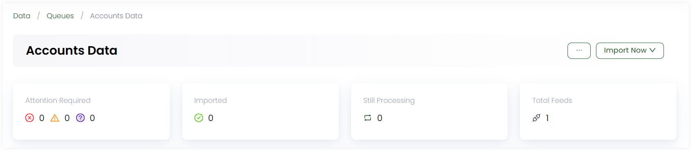
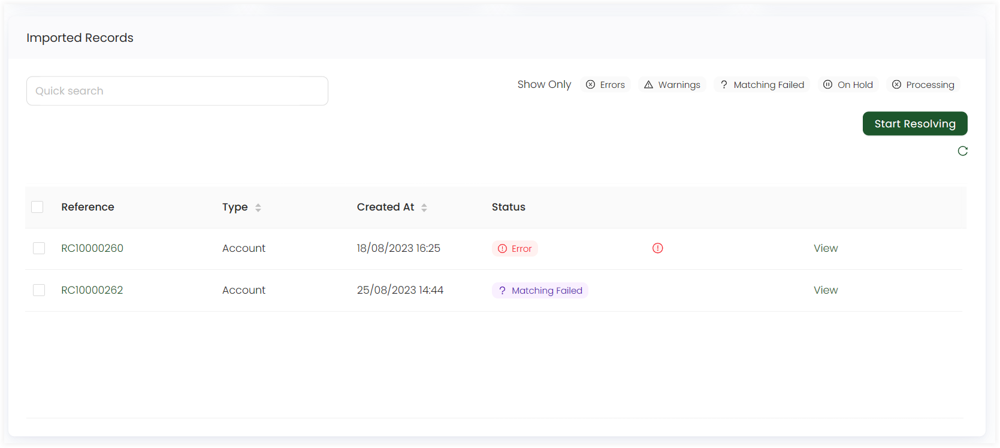
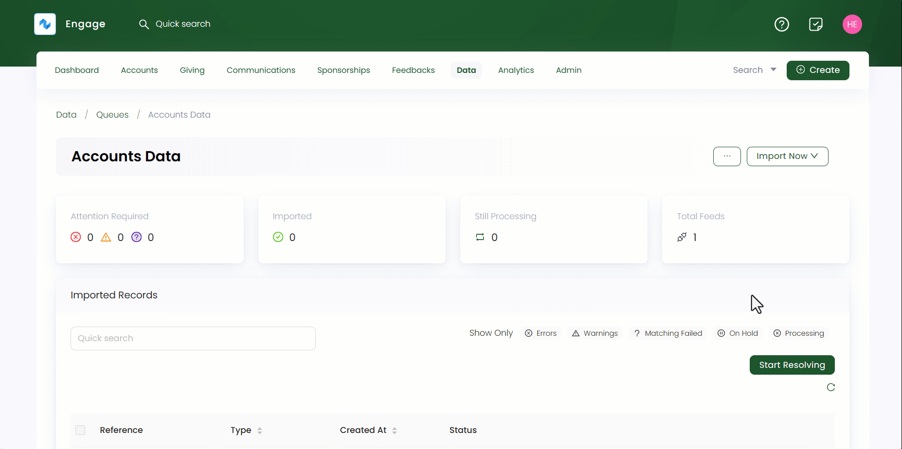
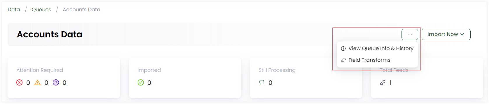

Similar to creating queues, you can view any existing queue in detail and edit its information within Engage.

**1.** Click *Data* in the top menu bar and then *Imports* in the quick navigation section to view the queues screen.

**2.** On the *Import Queues* screen, select any queue that will redirect towards a detailed queue screen. 

**3.** The upper section of the queue shows different sections including:

    - Number of imported records with status *error*, *warning* or *matching failed*
    - Number of records imported without any error
    - Number of records still processing 
    - Total number of feeds created for the queue

**4.** The lower *Imported Records* section shows a list of all the imported records in a queues feed with the following defined parameters. Click *Start Resolving* and the system automatically starts resolving each imported record automatically. This function also corrects a record which goes into an error state maybe due to mandatory data missing or duplicates. You can also view a record in detail by clicking the *View* button.

| Lists Parameters | Description |
| ---------------- | ----------- |
| Reference | Unique reference number of imported record. | 
| Type | Type of queue the record is imported into. |
| Created At | Date and time the record was imported at. |
| Status | Status of the imported record. |

**5.** You can click the *Import Now* button to select the relevant template (feed) you wish to import data with. These templates are different on basis of the queue. Download the *sample file* and populate this file with the same data as advised or choose another file and fill it with the same data and columns.

:::info
*Import Now* option appears when you have created feeds for a certain data queue. 
:::

**6.** Click the **three dots (...)** on the top right and explore the options given below in the table.

| Options | Description |
| ------- | ----------- |
| **View Queue Info and History** | This section includes the *Queue Information*, *Feeds* and the imported data run tests via feeds and other details in the form of a list. To know more about how to test feed (webhook) data, refer to <K2Link route="docs/category/developers--designers" text="Testing Webhook Data in Developers and Designers documentation" isInternal/>. You can also edit the queue information via clicking the drop-down and then *Edit information*.  |
| **Field Transforms** | This section allows you to manipulate external data into something meaningful within the CRM. e.g. your website may have a price handle such as 'food project', but in your system you do not have this donation item or the closest may be 'food fund' or 'food parcels'. The *transforms* function allows you to set a rule that when 'food project' donation comes in from your website, it will place this under the 'food fund' or 'food parcel' donation item within your system ensuring full data integrity. |

