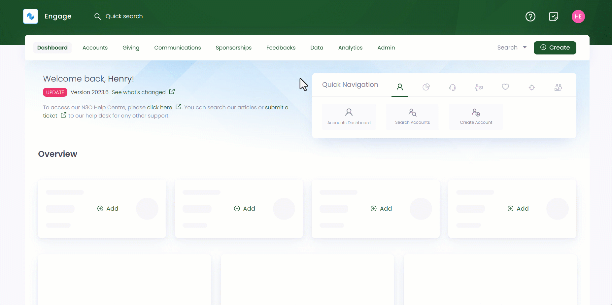
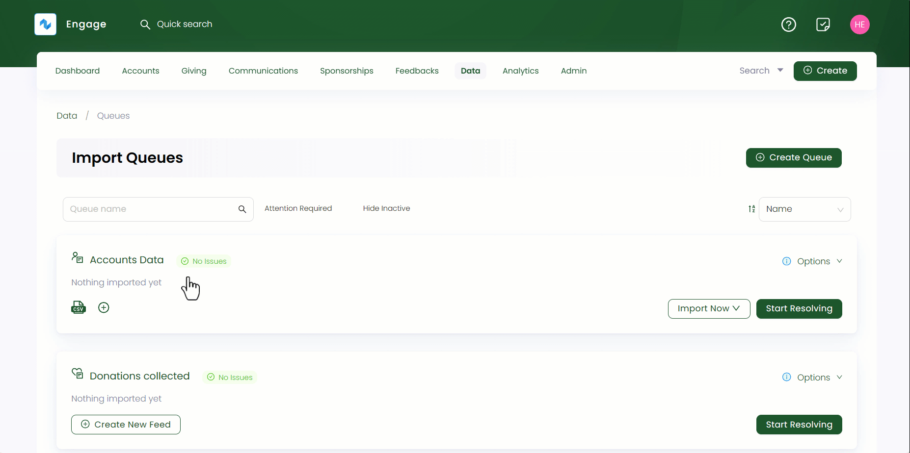
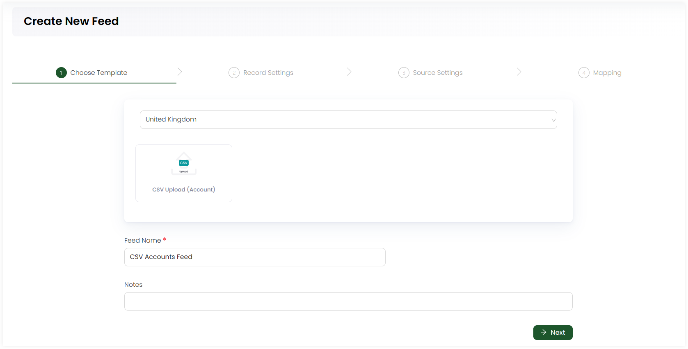
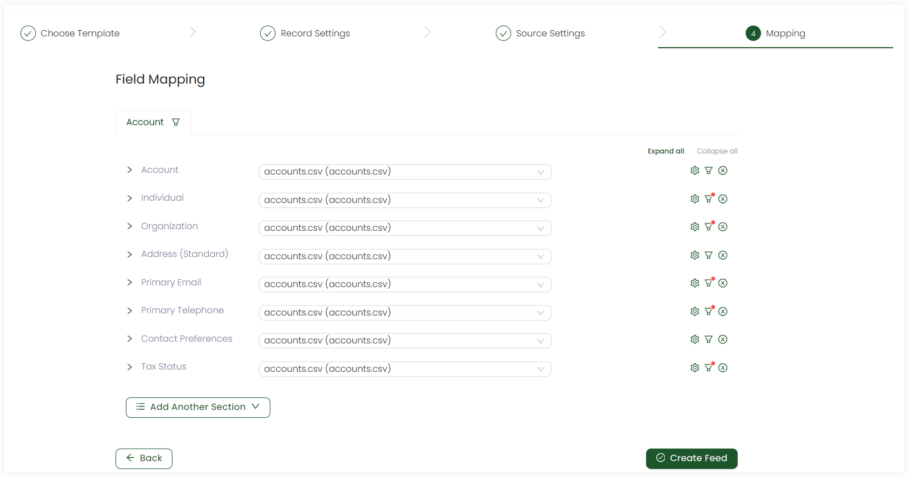
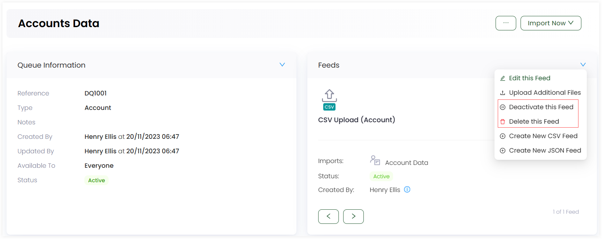

Webhooks, also referred to as feeds in Engage, are automated messages which allow you to send real-time data from one application to another whenever a given event occurs. Engage allows you to create and edit a webhook as per necessary.

## Creating Webhooks

To create a new feed, follow the steps defined.

**1.** Click *Data* in the top menu bar and then *Imports* in the quick navigation section to view the queues screen.

**2.** Select any queue, click *Create New Feed* and choose whether to create a *CSV* or *JSON* feed to land onto the *Create New Feed* screen.

:::info
For queues that already have created feeds before:

**1.** Either go to the selected queues detailed page, click the **three dots (...)**, then *View Queue Info and History* and in the *Feeds* section, click the down arrow and then *Create New CSV / JSON Feed*.

**2.** Or click the **'+'** icon on the queue itself and create a new feed.

:::

**3.** Under *Step 1: Choose Template*; select the country, feed type and input the *Feed Name* along with any extra notes.

:::note
Each feed type has a different template for each queue selected before. For example, *CSV feed type* under a *donations queue* will have *CSV upload(Donation)*, *JustGiving Donations Report* and *LaunchGood Donations Import*. 
:::

**4.** In *Step 2: Record Settings*, almost all checks are pre-selected for e.g. "With the data in your file(s), Engage should try to..." and then the option *Create new Account*. You can also select any other option as you wish for any statement. Furthermore, *Additional Data* can also be selected, and a separate tab will be visible to tickmark its related statements. 

**5.** In *Step 3: Source Settings*, upload the CSV file that contains the senders data. Each file uploaded will have a separate *File Preview* section containing different self-explanatory headings (*Filename*, *Filter* and *Formatting Options*) to be completed. For an understanding, the sample file preview includes an answer under each heading, and you can review it to complete your actual file upload.

**6.** In the last phase, *Step 4: Field Mapping*, you link (map) the fields in the imported source data to the fields in the CRM system like Engage. For example, *Import ID* field in Engage can be mapped onto *Account ID* in source data for identification. Choose the uploaded file for each generic field like *Account*, add meta fields or fill out the ones pre-populated. Furthermore:

- You can apply filters to specify conditions on fields in the source data for more clarification via *filter icon*.
- You can configure options for those fields in imported data which do not contain any value via setting default values, so that Engage can use those default values.

**7.** As soon as the feed is complete, click *Create Feed*.

## Editing or Deactivating Webhooks

You can also edit an existing feed of any queue by landing onto the selected queue screen, click the **three dots (...)** and then  *View Queue Info and History*. Next, click the drop-down in the *Feeds section* and then *Edit this Feed* option. 

You can also deactivate or delete a feed with *deactivate* and *delete* options. Each feed created has a minimum summary including *type of imported data*, *status* and the *name of user* who created a feed. 

